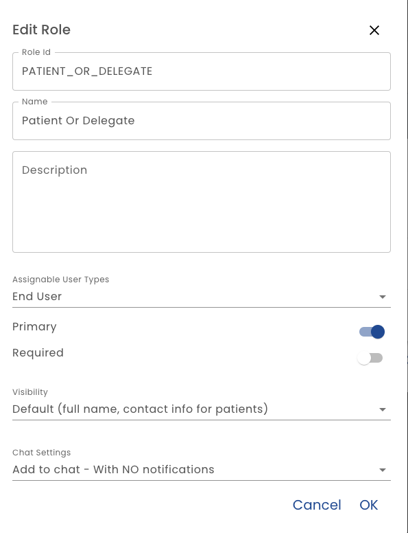

# Role Editor

**Role Id** - This is the identifier for the role.  It should not contain spaces or special characters.

**Name** - This is the name of the role that will be displayed in the user interface when the role is referenced.

**Description** - A paragraph that describes the role. It used when displaying the role to other participants or when learning about a plan.

**Assignable User Types** - You have a choice of making the role assignable to one or more of ADMIN, STAFF, or USER types.  See [User Types](/using-healix/user-types) for details on user types

**Visibility** - You can indicate if other participants in the plan can view the just the participant's first name name or the defaults for that user type.  By default, ADMIN and STAFF can see the full name and contact info, USERS can see full names, but not contact info.  See the [Roadmap](/roadmap#role-visibility) for future plans.

**Chat Settings** - Here you can determine if:

* Users assigned to this role should be excluded for the chat channel for the plan.  For example, a doctor may be monitoring and responding to chat while an admin role would be.
* Users assigned to this role will be included in chat and should get unread chat notifications.  For example, if a message is sent to the channel but the user does not read the chat message a notification email will be sent
* Users assigned to this role will be included in chat

