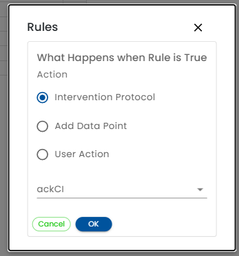

# Action

The Action column defines what happens when the rule triggers.  When the action button is clicked, a dialog is displayed.

**Intervention Protocol** - When *Intervention Protocol* is selected, a Form Assignment that was configured to be assigned by a rule must be selected in the drop down.

**Add Data Point** - When *Add Data Point* is selected, you must specify which field is to be changed and enter a [Healix Expression Grammar](/dynamic-data-model/healix-calculation-grammar) to compute its value.

 * Set - You may select any writeable field in the [dynamic data model](../../dynamic-data-model/referencing-data.md) or any [Custom Field](/creating-plans/forms-and-fields/custom-fields) that you have defined.  
 * Expression - Enter a [Healix Expression Grammar](/dynamic-data-model/healix-calculation-grammar) for the computed value.  This can be as simple as a value.  Numbers and booleans do not need quotes.  Text strings do need quotes.

**User Action** - When *User Action* is selected, you must select the action to be taken. 

 The available actions are:

* Logout - Logs out the user and ends their session.
* (More coming soon)

When *Logout* is selected, the user role that is to be logged out must be selected.  The user role must have been previously defined in the [Roles](../roles/) section.

