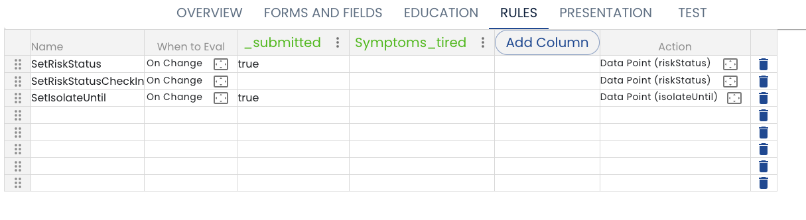

# Rules

Rules allow define business logic to create form assignments ([Tasks](/creating-plans/forms-and-fields/form-assignment-editor) or [Education Assignments](/creating-plans/education)) or to populate [Custom Fields](/creating-plans/forms-and-fields/custom-fields).

The decision table editor is modeled on a spreadsheet.  To add a new rule, just type data into the appropriate column.

  **Name** - The name column is for you to enter a name that will be used when referencing the rule, for example when debugging the rules.

  **When to Eval** - This column is used to determine when the rule should be evaluated.  When the button is clicked a dialog box is presented.  See [When to Evaluate](./when-to-evaluate) for details.

  **Value Columns** - The next set of columns allow you to define a values to examine with your business logic.  To add a new column, click the *Add Column* button and choose on field from the list of fields from the [Dynamic Data Model](/dynamic-data-model).  You can also click an existing column heading to change the field that is examined by the rules.

   * Once you have created the column, you can enter a value (and comparison operator) in the main body of the table. See [Rules Shorthand Syntax](./shorthand-syntax) for details
   * If you enter a value in more than one column for a given row (rule) each of the comparisons must be true in order for the rule to fire.  In other words, the values are logically ANDed.

Value columns can be removed with the Hamburger menu beside the column name. 

Rule rows can be removed by clicking the trash can icon on the row to be deleted.

Note that we plan several enhancements to the rules editor.  See the [Roadmap](/roadmap#rules-improvements)
