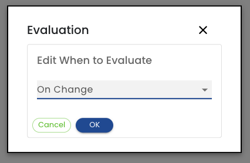
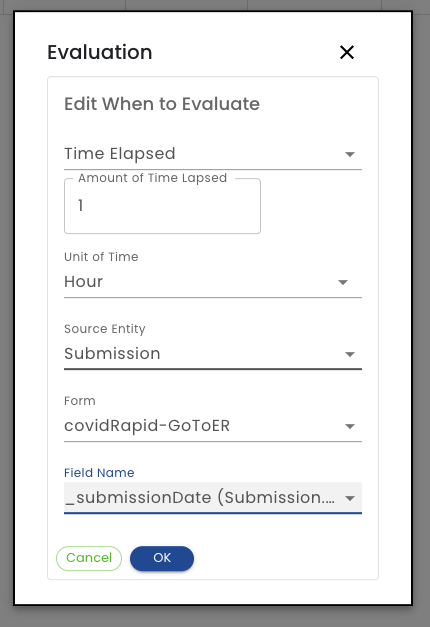

# When to Evaluate

**On Change** - When selected, the rule is evaluated whenever a user submits a form. This is the most commonly used option.

**Time Elapsed** - This option is typically used to trigger a rule when something doesn't happen.  For example, you may want to assign a form to a nurse if a patient has not completed a form assignment N days since the plan start date or since the patient had a form assigned.

**Amount of Time Lapsed** - Enter a number representing hours, days, etc.

**Unit of Time** - Enter the units of time specified above (Hours, Days, Weeks, Months)

**Source Entity** - Select the [Entity](/glossary#Entity) that be checked.

**Field Name** - Select the field that will be checked.  Only Date Time fields are available.  When the duration specified above surpasses the value in this field, the rule will be triggered.
