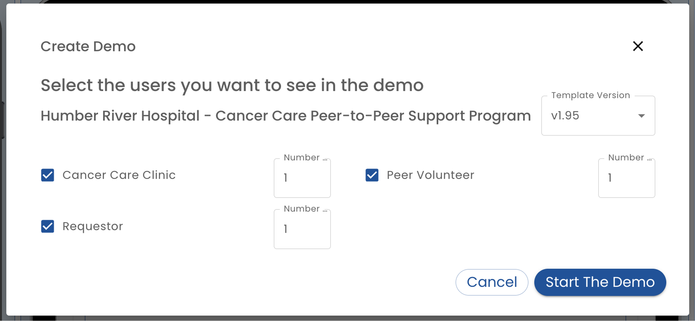

# Simulator

The Simulator, accessed via the *Test* tab, is used to demonstrate, manually test and automatically test a plan.

## Role Testing

The simulator will run the app in a simulated phone for each role defined in the plan.  A test user with a randomly generated name is created. This allows for convenient testing of the plan.  For example, if completing a task in one role leads to the addition of a task to another role, this is immediately shown.

To put a role into desktop mode, use the full screen icon in the upper right corner of the simulated phone.

## As At (Time Warp)

By change the As At setting, the plan is run at the specified time.  For example, if form assignments have been configured to appear N days after the start or if you have configured [time elapsed](/creating-plans/rules/when-to-evaluate) rules, then these conditions can be conveniently tested.

:::caution

Time travel to the past leads to unpredictable results.  For example, if *as at* was set to the future in order to trigger a time elapsed rule and a task was assigned to a user, setting the clock back to an earlier time does not undo the form assignment.

:::

## Reset (User Counts)

The *Reset* button pops a dialog where you can specify how users in each role to create.  When OK is pressed, new test users are created and simulation starts fresh.

## Test Automation

As well as supporting manual testing, specific scenarios can be recorded, edited and played back in order to automatically tests a plan.  Creating automated tests makes it faster to release new versions of a plan.

