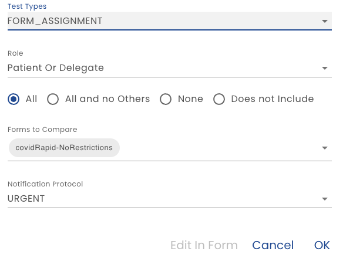

# Adding or Modifying a Step

A step can be manually added or edited.

**Name** - The name of the step that used when displaying test results

**Step Type** - Specify the step type

**Form Submission** - The step submits a form

**Test** - The step performs a check

**Time Set**- The step sets the test to a specific date

## Form Submission Steps

The  way to create a Form Submission step is to [Record](./recording-steps).  It is also very useful to be able to edit a step, especially after copying a test case.  For example, a test case may be very similar to another except the data submitted is different.

When you edit an existing Form Submission Step, the [JSON - JavaScript Object Notation](https://en.wikipedia.org/wiki/JSON) is displayed.  You can expand and collapse portions of the JSON and edit values by clicking the pencil icon that appears when you hover over a value.

You can also use the defined form to edit the values.  For example, when the *Edit in Form* button is clicked the form that created the data is popped up and you can change the values the same way and end user does.

## Test Steps

A test step checks the state of the plan to ensure the results are as expected.  For example, after a patient enters an assessment, the system is supposed to indicate that they should go to the Emergency Department. A test step can check if that actually happened with a given set of patient responses.

The type of test must be specified.

### Form Assignment Tests

A Form Assignment Test Type checks to see if a task or education has been given to a user.  For example, after the plan is created, a specific form should be in a users task list.  Or, if a user submits a form, perhaps with specific values, then another task is assigned.

**Role** - Identify the role that is being checked

**Comparison Type** - How should the list of forms (entered on the next step) be compared to the users assignments.

   * **All** - Each form listed must be assigned.  It's OK if other forms are assigned too
   * **All and No Others** - The user's assignments must match the list exactly
   * **None** - The user should not have any forms assigned
   * **Does not Include** - The test will fail if any of the specified forms are present

**Notification Protocol** - The notification protocol that the form was assigned can be checked.  Chose *Any* to not check.

### Manual Review Tests

A Manual Review Test pauses the execution of the automated test and displays the test description to the content manager running the tests.  This is useful for testing things that are beyond automated tests capability.

### Logical Expression Test

An arbitrary [Healix Expression Grammar](/docs/dynamic-data-model/healix-calculation-grammar) is evaluated.  If the expression is false, the test fails.  This is useful checking plan status or risk status.

:::caution

Not implemented yet

:::

### Email and SMS Send

This allows the automation to see if an email or SMS was sent to a specific user.

:::caution

Not implemented yet

:::

## Time Set Step

The first step of a test case always sets the "clock" to a specific date.  This serves as an anchor for subsequent tests. If the plan has been configured to perform actions based on some time criteria, then the test can advance the time beyond the initial date set by the first step.  For example, an administrator should be notified that a patient has not completed a task by a certain elapsed time past the plan start date.

Create time set steps with [Record](recording-steps).  If you need edit use ISO date/time format.
