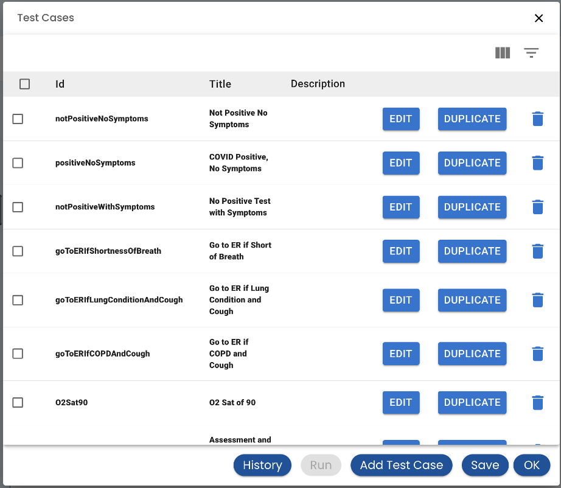

# Test Automation

The Test Cases button brings up a list of test cases that has been created.

## Creating and Editing a Test Case

The *Add Test Case* or clicking *Edit* on an existing Test Case brings up the Test Case Editor.

**Title** - A few words that describe the test case

**Tags** - choose on or more tags from a list of Tags.  The list of Tags is created on the main Test tab

**Description** - a or sentence or two about what the test case does

**Steps** - The steps table has a list of steps to perform when running the test. The first step, which is created for you, is to set the time. You can add new steps by pressing the *Record* button or add a step manually with the *Add Step* button.

## Import and Export

The test case can also be exported to a file.  To duplicate a test case and make changes:

* Go to the test case that you wish to make a variation of
* Export it to a file
* Create a new test case
* Import the file created

See the [Roadmap](/roadmap#test-automation-improvements) for work-in-progress features
