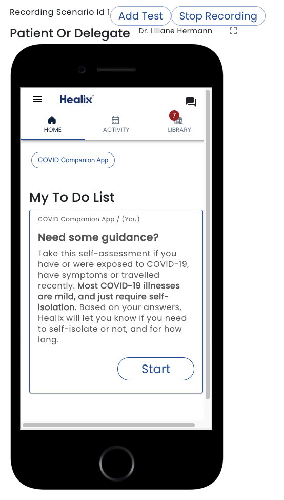

# Recording Steps

Immediately after creating a new test case, or after running an exist test case, you can press the *Record* button.

Tests steps are automatically created by going into the role simulation windows and using the app.

To create a [Form Submission Step](./add-step#form-submission-steps), simply go to desired role, use the app and complete a task or open an education.  A [toast](/docs/glossary#toast) is displayed confirming the step has been aded.

To create a [Time Set Step](./add-step#time-set-step), use the [As At](/docs/creating-plans/simulator/#as-at-time-warp) date control to set the date forward.

If you want to add a Test Step, click the *Add Step* button.  See [Add Step](./add-step#test-steps) for details.

