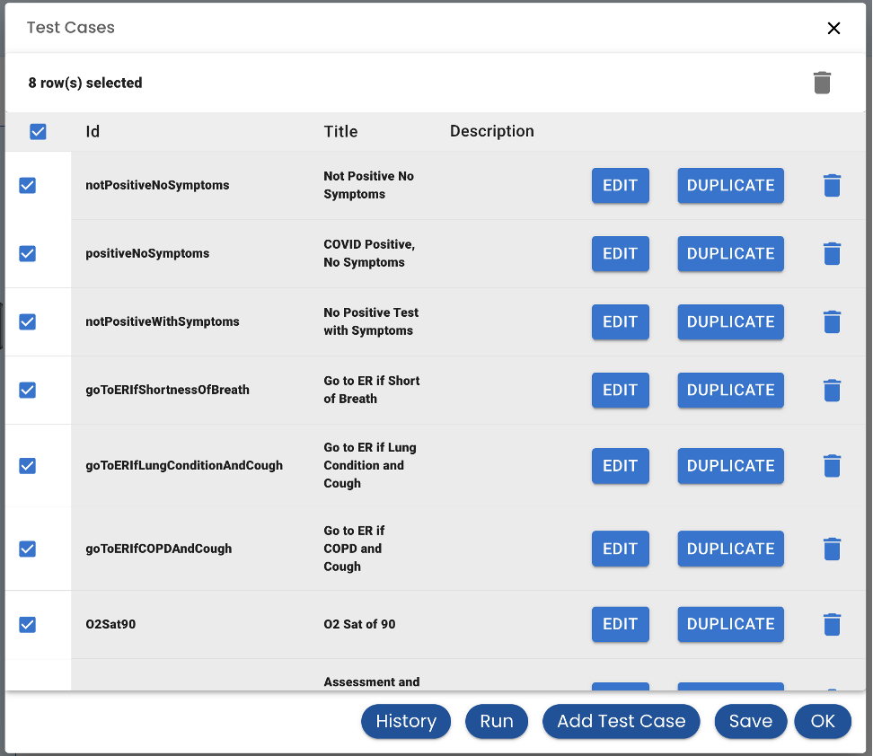
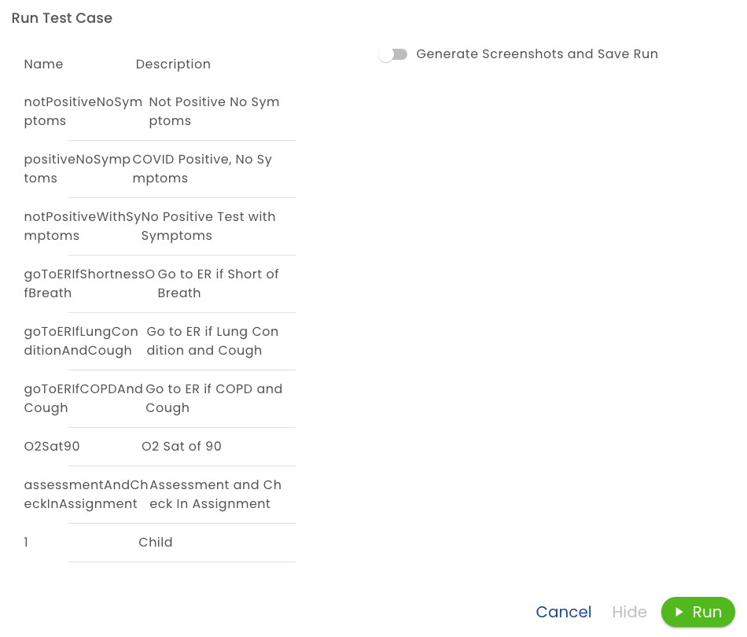
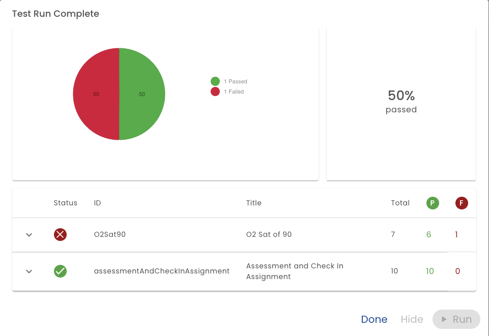
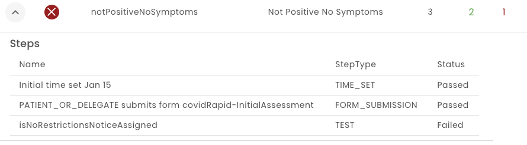

# Running Test

Typically tests should be run when releasing a new version of a plan.  Although, tests are also useful to generate data as part of the authoring process or for demos.

To run one or more test cases, first select the tests from the test case list:

And then click *Run*.  A confirmation screen is displayed:

**Generate Screenshots and Save** - If this selected, the test results will be recorded in the test history.  This can also be very useful for compliance with quality programs.  It will also generate and download screenshots. (In the future the screenshots will be saved to the server and used for comparison.)

The system then start executing the steps in sequence:

Then the results of the test is shown.

If a test fails, the expander shows the reason for the failure.

