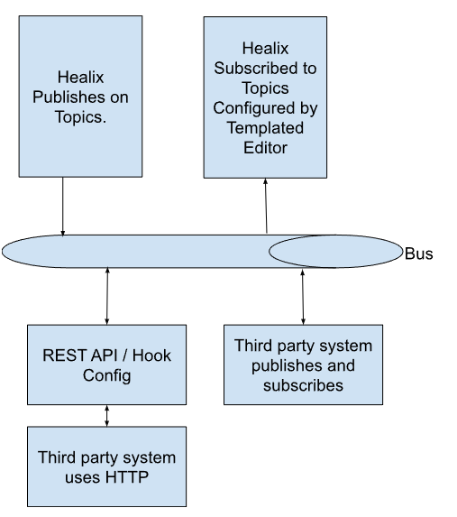

# Integration

Healix integrates with other systems through a classic enterprise bus, pub/sub design pattern.

* System level events are published by Healix to the bus.  These system events include when a plan is assigned to a person, when a person submits a form or when a work queue item's status is changed.
* Third parties can work directly with the Healix NATS bus or or exchange information via a REST API / WebHook.
* The Plan Template Editor, is used to configure how to respond to inbound messages

## Configuring Healix to Respond to Incoming Events

A third party system can publish events to the Healix integration bus.  In order for Healix to react to these incoming events, a content manager must describe the inbound event payload and then implement rules to respond.  For example, if a scheduling system posts a time slot, a rule can assign a form to the user that displays the upcoming appointment time.

Configuring the integration event payload is done in the [template editor's integrations section](../creating-plans/forms-and-fields/integrations).  Configuring the reaction is done in the [rules](../creating-plans/rules/) section.

## System Messages (Outgoing Events)

## Accessing the Bus via NATS

Please contact support@healix.me.  In the future this process will be automated with an API Key.

## Configuring Web Hooks and HTTP Post

As an alternative to working with the pub/sub mechanisms provided by NATS, you can configure a URL and filter criteria so that a system message is converted to an HTTP post.  (Admin UI Coming Soon.)

