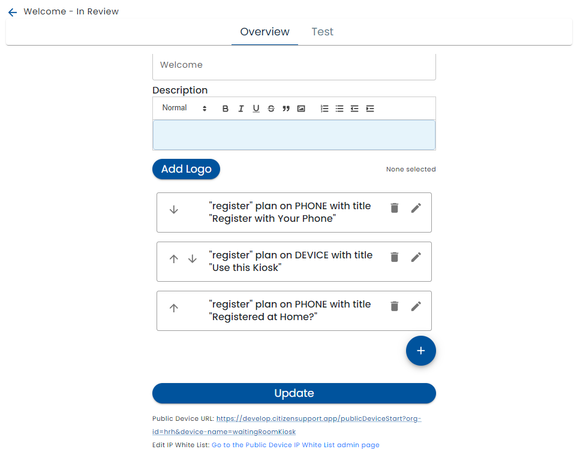
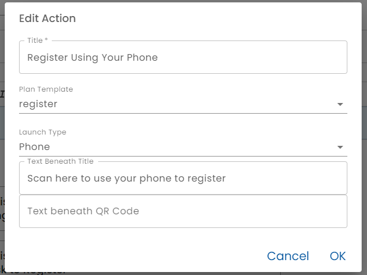

# Edit Public Device

The Overview tab of the public device editor allows the configuration of the essential aspects of a kiosk or a shared tablet available to users.



* *Public Device Name* - this is the name that other parts of the system, uses to refer to the device.  For example, it is part of the URL used to access the public device.
* *Status* - the Status can be In Review or Active
  * *Active* - If the status is Active, users accessing the device will see that version
  * **In Review* - In the status is In Review, the changes are only shown in the test tab.  
* *Title* - The Title is shown to users at the top of the kiosk or table screen when they start using it.
* *Description* - the optional description text can contain internal notes about the public device.  For example, which room it is in, the type of device and it is used for
* *Logo* - a logo can be optionally configured.  It is displayed beneath the title and before the actions area
* *Actions* - Various actions that can be launched from the kiosk

## Actions

When the *Edit* (pencil) button beside an Actions is clicked or the Plus button is pressed to create a new action, the action editor is displayed.



* *Title* - the title is displayed above the button or QR code for the action.
* *Plan Template* - select the [Plan Template](../../creating-plans/creating-a-plan) that users will run.  Typically a plan referenced here has been built to be launched from the public device or has checking in at the public device as a step.
* *Launch Type* - There are three types of actions that can be performed by users from the kiosk or shared tablet.
  * *Phone* - When Phone is selected, a QR Code is displayed.  Users can use their phone camera to scan the QR Code which will lead to the landing page of the plan selected in the Plan Template.  The user then uses their own phone to complete the registration processes, or whatever process has been configured in the plan. This is easier for users because they will use a device they are familiar with and the whole process is "touch-less" which reduces the spread of germs.
  * *Device* - When Device is selected, a Button is displayed.  Users will use the kiosk or tablet to complete the workflow.  When running plans on the public device, special behaviors such as automatically logging out users after a few seconds of activity occur.
  * *Scan for Integration Event" - If users are encouraged to start the plan before they arrive at your physical location, they can scan the QR Code to trigger an [Integration Event](../../integration/).  The associated plan is expected to have a *Check in Scan* integration type configured and rules that fire when the event occurs.  For example, the user can be added to a [Work Queue](../../work-queues/creating-work-queues) when they arrive or you may want to change the status of an existing work queue item with a [rule](../../creating-plans/rules/).
* *Text Beneath Title* - This text appears directly beneath the title entered above is a smaller font.  Typically it tells the user what to do. E.g. "Scan here to register with your phone", "Tap here to use this device to register" or "Registered at Home? Scan here to let us know you're here".
* *Button Text" - If the action is Device, then enter the text that appears on the associated button.
* *Text Beneath QR Code (or button)* - Additional text or instructions

## URL and Chrome Kiosk Mode

The URL of the public device is displayed.  This URL can be copied and pasted into the browser on the kiosk or tablet being used as a public device.

The Chrome browser has a kiosk mode that hides the address bar, launches in full screen and other features appropriate for running on a publicly shared hardware device.  For example, Chrome can be launched on a Windows machine in Kiosk mode as follows.  

```
"C:\Program Files\Google\Chrome\Application\chrome.exe" --user-data-dir="C:\Users\user\AppData\Local\Google\Chrome\User Data\Profile Kiosk" --kiosk http://healix.me/publicDeviceStart?org-id=hrh&device-name=lobbyKiosk
```

Chrome OS also has special kiosk features.


# Test

The *Test* tab is used to preview the Public Device Configuration. It varies from the "real" device in that QR Codes are clickable (for testing purposes) and navigation to other parts of Healix is possible.

## IP White Listing

Note that the test tab is also subject to IP White Listing.  See [IP White Listing](../../admin/ip-white-list/) for more information.  A link to the IP White Listing page is provided on the Overview tab.


