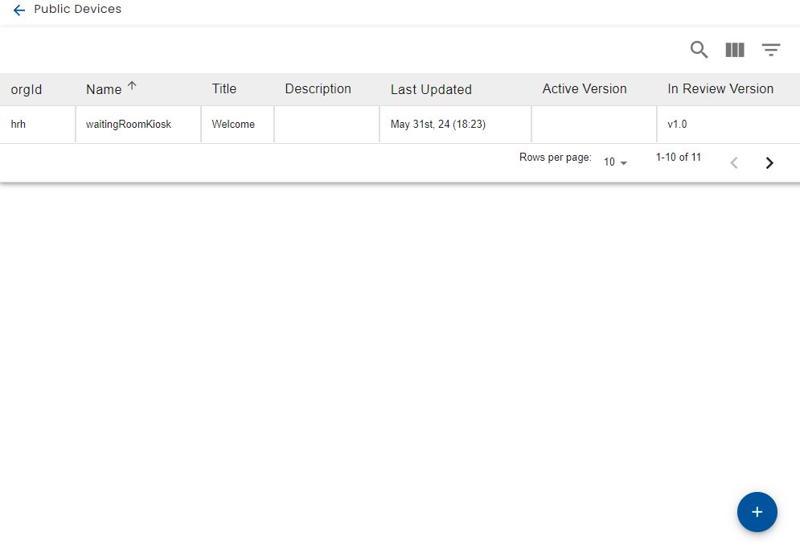

# Creating Pubic Devices

Users with [content manager](../../using-healix/user-types.md) or administrator privileges are able to define public devices via the menu.

A list of public devices is displayed and you can create a new public device with the + button on the bottom right.

Creating or clicking on a public device, brings up the public device editor.
