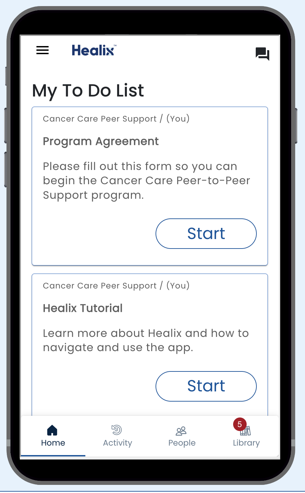

# Healix basics

* The Home tab is where you see the your tasks for your own plans or tasks for plans for others
* The Dashboard tab provides visual information on your progress
* The Activity tab is where you can see a feed of recent events related to plans
* The Library tab has educational matieral about your current plans and lets you discover new plans to join
* The message icon in the upper right lets you chat with other users.

