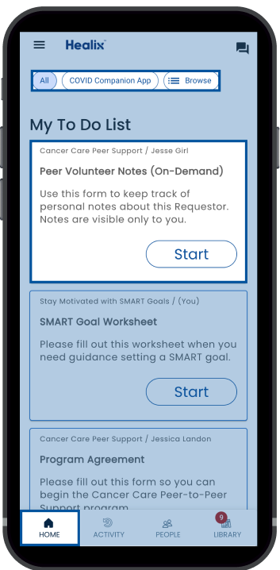

# Home

Home is where you will find your To Do list and see key information to help you on your journey. On the Home page you will find:

* **Filters**: at the tope of the Home page are filters that allow you to manage what you see on your list.
* **Tasks**: your To Do list is made up of Tasks. Each Task has a name, details about what you need to do, and information about the plan and person the task is for. To start a task, click the “Start” button.

If you are staff, then you may also have [work queue](../work-queues/using-work-queues) tasks in your task list.
