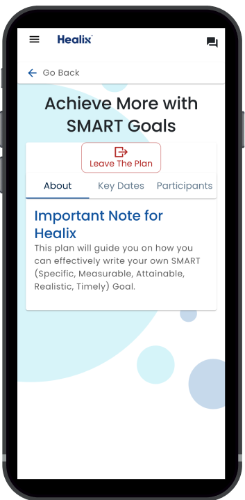

# Plan Details

Under the details page for a plan, you will find 3 tabs:

* **About**: a quick rundown or description of the plan.
* **Key Dates**: the date that you started and finished (if applicable) a plan.
* **Participants**: a list of people connected to you in this plan.

 

If you are viewing a self-serve plan, you can leave at **any time by selecting the “Leave the Plan”** button at the top. You will still be able to access the plan details after leaving.

