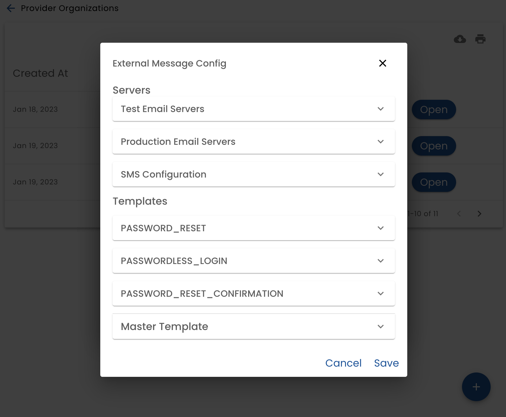
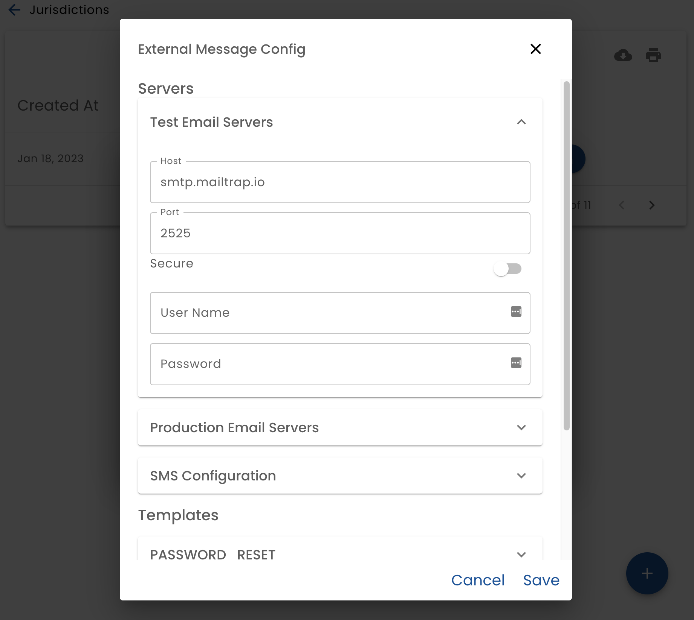
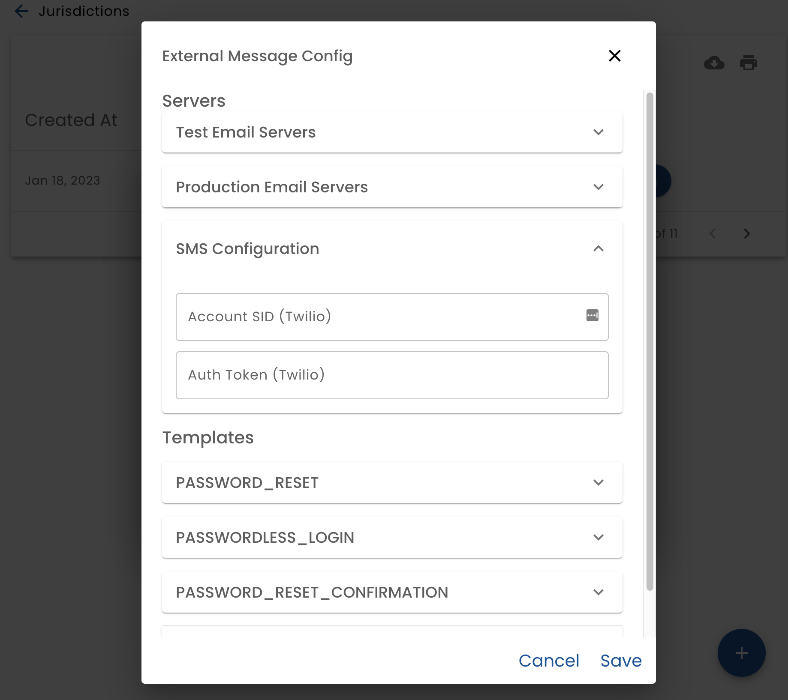

# External Messages - Server Config

The **External Messages** button allows you to configure email servers and format the messages that are sent for tasks such as password resets and passwordless logins.

## Mail Server Configuration

Two email servers can be configured.  One for production email (goes out to a real mail server) and another for testing only (typically point Mail Trap, which acts like a mail server, but does not actually send real emails.)

When configuring an email server provide the server address, port, protocol and credentials.

## SMS (Twilio) Configuration

When configuring SMS, provide the Twilio SID and Auth Token.

