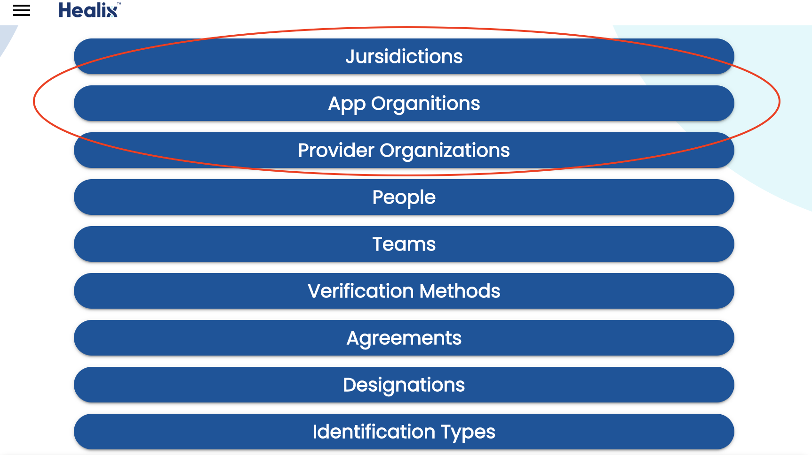
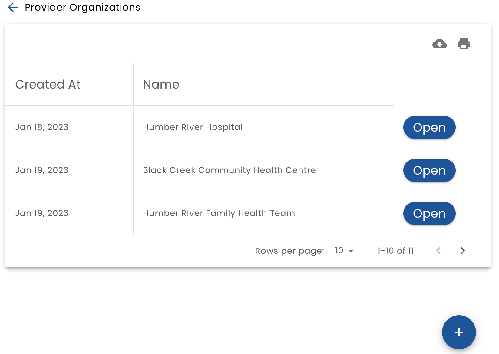
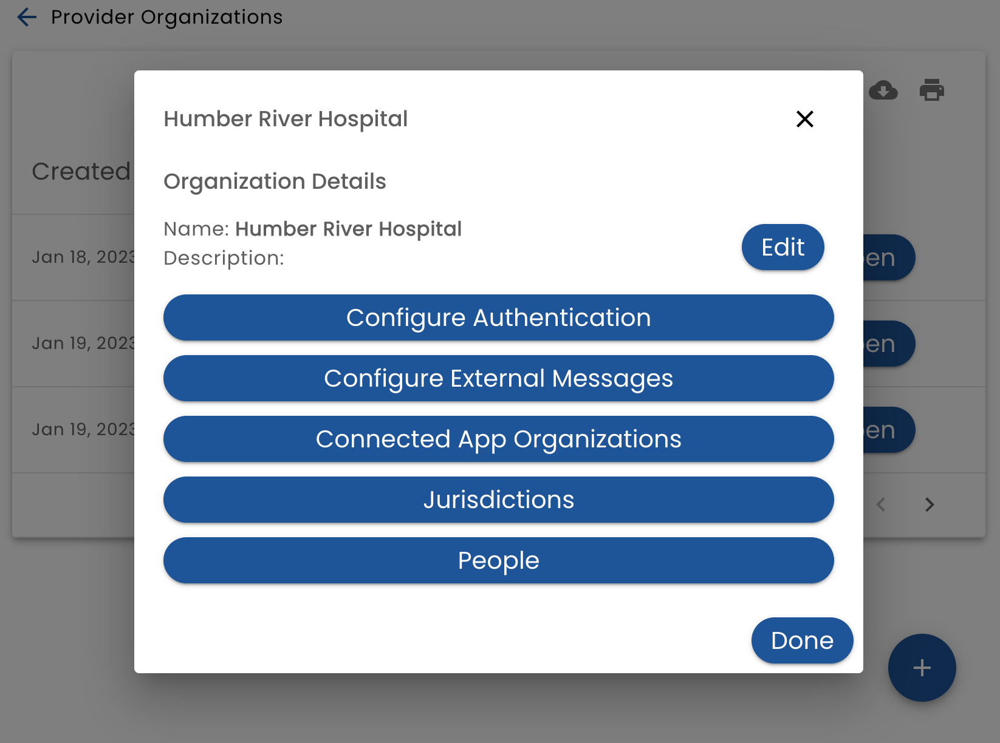

# Organizations

A key concept in Verid is an _Organization_.

An _Organization_ is an entity that has relationships with people and relate to real world businesses such as hospitals, clinics, banks and technology companies.

Verid has three types of organizations:

* **Jurisdiction** - a top level organization that manages other organizations
* **Provider Organization** - an organization that delivers services.  These services can be of any type such as healthcare service, financial services or even entertainment services
* **App Organization** - an organization that provides technology solutions to Provider organizations

The first three choices on the main level allow you to access each organization type:

## Organization List

When you select an organization type, the system will display a list of organizations.

Click _Open_ to view or edit the organization or the **+** button to add a new one.

## Edit an Organization

