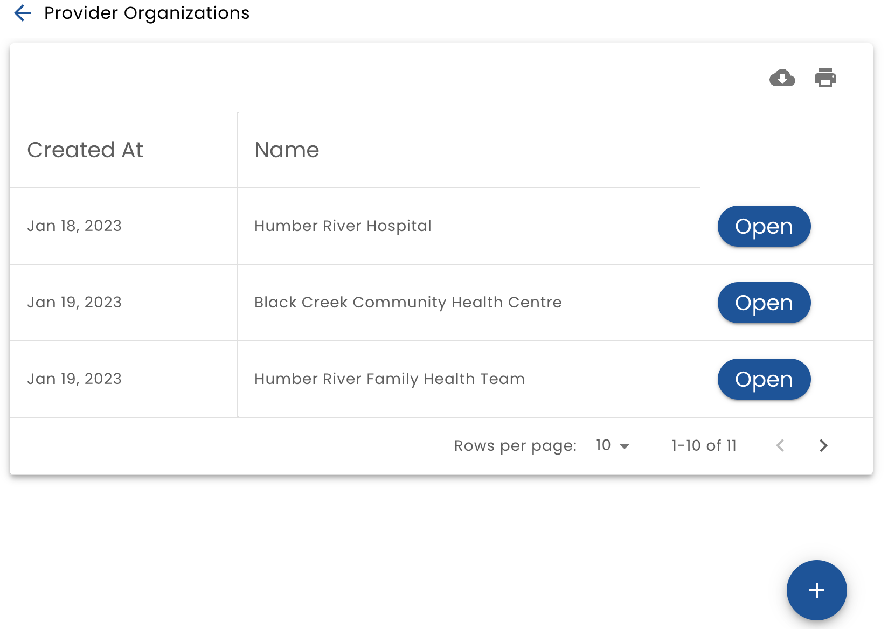
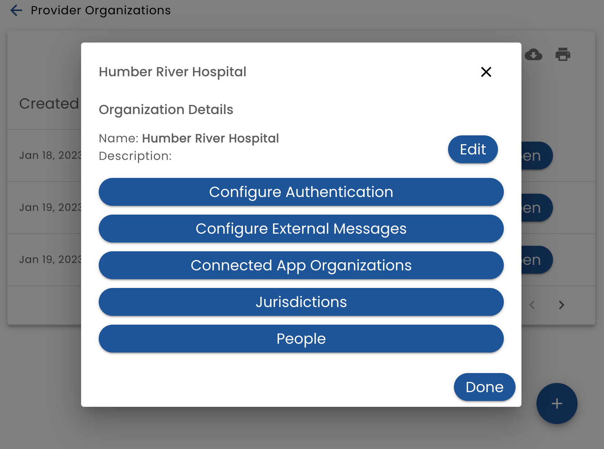

# Organizations

A key concept in Verid is an _Organization_.

An _Organization_ is an entity that has relationships with people and relate to real world businesses such as hospitals, clinics, banks and technology companies.

Verid has three types of organizations:

* **Jurisdiction** - a top level organization that manages other organizations
* **Provider Organization** - an organization that delivers services.  These services can be of any type such as healthcare service, financial services or even entertainment services
* **App Organization** - an organization that provides technology solutions to Provider organizations

The first three choices on the main level allow you to access each organization type:

## Organization List

When you select an organization type, the system will display a list of organizations.

Click _Open_ to view or edit the organization or the **+** button to add a new one.

## Edit an Organization

### Authentication Configuration

The Authentication Configuration option displays a list of authentication methods and allows you to add and modify them.

The authentication types that are supported are:

* **Locally Provided** - Verid manages the authentication and the user logs in with a email or phone number and a password (permanent or one-time-use) specific to Verid
* **Externally Provided** - The application that is using Verid has its own authentication mechanism (bring your own auth). Verid and the app set up a trust relationship through a shared secret.  This is used when you don't want Verid to provide any authentication services (for some or all of your users)
* **Open Id** - Users can authenticate using "Login With".  This can be "Login with Facebook" or "Login with Google", but more typically logging in with the system that manages authentication for your organization.  This allows users to sign in to the system with their work credentials (staff users) or your patient portal (end users)

An organization may define many configuration methods and allows them to be associated with user types. For example, you may want end users to login with a patient portal, while staff login with their work credentials.

#### Locally Provided

