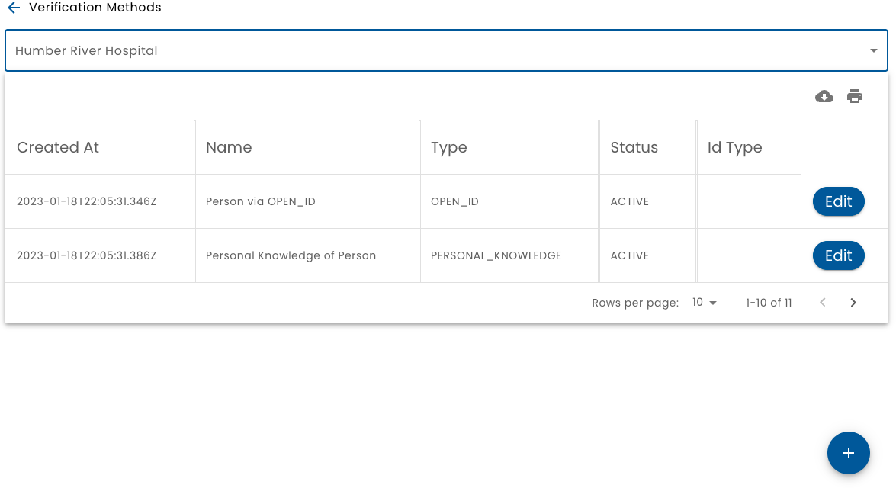
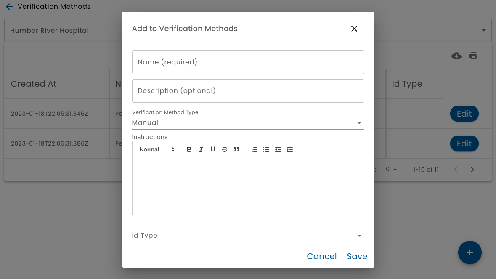

# Verifications

A _Verification_ describes a way that a person's identity has been verified.  Every addition or change to a person's identity requires a verification.

If this sounds cumbersome, don't worry.  There are two [Verification Types](#verification-types), (_Self Declared_ and _Personal Knowledge_) that do not require any further information.  When using those, names can simply be typed in like any other system.

However, some business processes may require a more robust identity verification.  For example, before a hospital can send information to a patient from their internal systems, the hospital is required to be very certain that the person is who they claim to be.  Financial services companies must also comply with regulatory requirements known as KYC, Know Your Client.  These regulations are in place in order to combat money laundering and terrorism. 

## Verification vs Authentication

Authentication usually refers to the process of a user proving that they control an account.  For example, entering a password or entering a multi-factor text code proves that the person logging is the account owner because no one else should know the password or have access to your phone.

Verification ties an account to a real world human identity.  This typically happens at start of the organization's relationship with the person.  Although, Verid supports a concept of _Progressive Identity_, where many features do not require a strong identity verification.

## Verification List

**Verifications** from the main menu leads to a list of verifications configured for the selected organization.

Verifications can be created or edited.   Each verification has a name and a description.  The most important setting is Verification Type.

:::note

You must be an Admin of the organization in order to add verifications.

:::

## Verification Types

Verification Types are implemented by the system.  (Adding new verification types require changes to the system by developers.)

The following verification types are included:

### Self Declared

A _Self Declared_ verification type is where the end use simply provides the identity information.  This is the default verification type and often sufficient for many use cases.

### Personal Knowledge

A _Personal Knowledge_ verification type is similar to a _Self Declared_ except that it is a _Staff_ Role that is asserting the persons identity. 

### Manual

A _Manual_ verification type, allows an _Admin_ to define a series of steps that a _Staff_ member must perform in order to verify a person's identity.

When configuring a _Manual_ verification, an editor where verification instructions is displayed.  Basic formatting, such as heading levels, bolding, italics, bullet points, indentation, etc. is available.  These instructions will be displayed to a _Staff_ member when they are performing a manual identity verification.

One or more [Identification Types](../id-types) can also be specified.  For example, in Ontario, it is common for an OHIP card (Ontario Health Insurance Plan) to be used as a means of identifying one's self to receive healthcare services.  When a _Staff_ is performing a manual identity verification, they will be asked to provide the number (and expiry if configured) associated with the id.  (E.g. the person's drivers license number).

### Open Id

Open Id is typically used as a form of authentication. For example, "Login with Facebook" or "Login in Google" uses the Open Id standard to make it easier to sign up and sign in for web sites and apps that support it.

Open Id is also used to provide single sign on features.  For example, a staff member can use the login credentials of their work system to authenticate. Apps can "borrow" these credentials to avoid requiring the staff member to manage yet another password.

Verid leverages the Open Id authentication standard as a form of identity verification.  For example, if a Staff member uses their organizational credentials to sign in, the organization's Open Id configuration sends Verid that user's name.  This is very powerful, because a Staff member typically goes through extensive verification as part of becoming an employee or contractor for the organization.  Verid can leverage this work, by configuring a verification method to point at an Open Id configuration.

### Self Sovereign Identity

Self-sovereign identity (SSI) is an approach to digital identity that gives individuals control over the information they use to prove who they are.

The Ontario Government (as one of many examples) is starting to leverage SSI
https://www.biometricupdate.com/202109/ontario-plans-ssi-based-digital-id-by-fall-liquid-avatar-lauds-use-of-open-standards
https://www.ontario.ca/page/ontarios-digital-id-technology-and-standards

:::warning

Support for SSI is still in development.

:::
