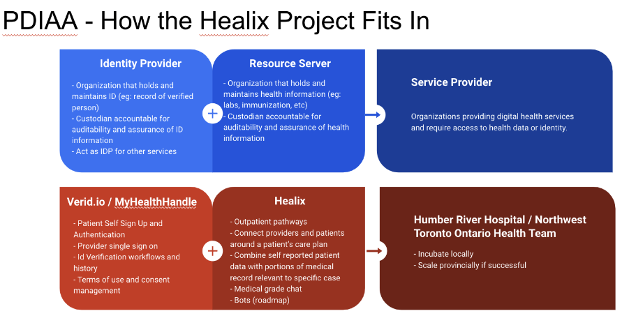

# Verid

## What is Verid?

Verid is short for **VER**ified **ID**entification.

From one perspective it is a *micro service* that handles users, their real world identities, organizations, teams, consent and people's designations for Healix.  

A *micro service* is an architectural and organizational approach to software development where software is composed of small independent services that communicate over well-defined APIs.

As we were developing Verid, we realized that many of problems it attempts to solve are not unique to Healix, or even unique to healthcare apps. So, as well considering it a micro service for Healix, it is being written in a way that tries to be useful to any project that faces the same problems.

What are the problems that Verid solves?

### The Real World Identity Problem

If you login into an application using your email address and password, all you have really done is proven that you control an account, and email address if you have verified it.  This is sufficient if we're only trying to protect information that you provide.  

However, if the system wants to give you information from your healthcare record or open an financial account where there is KYC (Know Your Customer) regulatory obligations, then we must know your real world identity with a high degree of confidence.

Verid is a solution for obtaining users' real world identities.  There is no one best technique for doing this and Verid is designed to use the approaches that are best for each given situation and be extensible and configurable to include new verification methods.

### The Many Overlapping Organization Problem

In healthcare, it is very common for an individual to practice at multiple organizations.  For example, a family doctor who works at the Humber River Family Health Team may have credentials at the Humber River Hospital to work a shift in the ED.  An individual managing properties may represent and work on behalf of many property corporations. 

When I authenticate myself as a specific individual, the relationships I have with these multiple organizations need to be understood.

Verid manages this graph of relationships.

Furthermore, organizations should not need to "start from scratch" when identifying a person if another trusted organization has already done the leg work.

### The Authentication Problem

There are many very good products and standards for managing signing in and single sign for a single organization.  

Verid also offers similar solutions in a multi-organizational context.

### The Consent Problem

When a user starts to engage with an app or an organization providing services, the user and an organization are entering into an agreement regarding the use of the services and technology and how people's privacy and data will be safeguarded. 

This is typically surfaced by adding an "I agree check box" to the sign in page.

Verid allows administrators to edit the terms of service for their organizations.  It will prevent users from using the system if they have not consented.  Acts of consent are audited.  If the terms change where people must consent again, the system will present terms the next time they log in.

While not a particularly "hard" problem to solve, from a micro service perspective it "belongs" to the signin module.  From an Verid as a product perspective, it solves a boring problem so apps don't have to implement point solutions themselves.

### Teams and Designations

Verid also allows team structures to be defined.  Professional designations, such as "Physiotherapist" "Nurse Practitioner", "Lawyer", "Real Estate Agent" or personal designations "Approved Volunteer", "Palliative Patient" can also be tracked.

Verid is a good place to manage this data about people and roles people are allowed to play at an organization.

## Verid Features

* Onboarding and user management for people and organizations
* Validates real world personal identities 
  * Leverage emerging self-sovereign id technologies as one of many verification tools
  * Manual verification workflows
  * Leveraging organizational signs as verifications
  * Integration with third party verification systems (TDB - we'll see if this is needed)
* Trust networks
  * Allow organizations to share verifications
* Configuring single sign on with multiple organizations (OpenId, Azure AD, etc)
* Consent management and auditing
* Automates presentation and agreement or rejection of terms of user, privacy and consent agreements and revocation
* Tracks the scope of practice of staff at an organization with designations
* Tracks status' of users with designations
* Allows participating organizations to define a trust network in order to leverage each others verification processes
* Track and assign teams
* Authentication related tools (passwordless login, passworded login, MFA, password reset, login with patient portal, login with hospital credentials, login with government system, etc). (Although “bring your own auth is supported and initially required)
* Sign in with Social (for end users)
* Sign in with Patient Portal (OAUTH)
* Headless APIs and brand-able and embeddable out-of-the box Ux
* Photo verification (future)
* Login and consent audits

:::caution

Many of the features above are coming soon and not currently available

:::

## How does it Relate to Ontario’s Trusted Account

## Self Sovereign Identity (SSI)
* A reasonable intro to Self Sovereign Id (SSI): https://tykn.tech/self-sovereign-identity/
* The Ontario Government (as one of many examples) is starting to leverage SSI
  * https://www.biometricupdate.com/202109/ontario-plans-ssi-based-digital-id-by-fall-liquid-avatar-lauds-use-of-open-standards
  * https://www.ontario.ca/page/ontarios-digital-id-technology-and-standards 
* Verid will interact with SSI and store its results for fast access. This follows the pattern of blockchain development tools such as https://moralis.io/ and https://thegraph.com/en/ .  In order for developers to avoid the complexity and latency of working directly with blockchains (or directly with wallets), information that is relevant to the application is stored in standard centralized databases
* If a user creates an account on Verid and then runs a Driver’s License verification using the Ontario credential issuer, we can store a verification event associated with the user in our database.
* SSI seems to have a lot of momentum and will soon be an everyday reality
* Verid will make leveraging SSI fast and easy for developers

