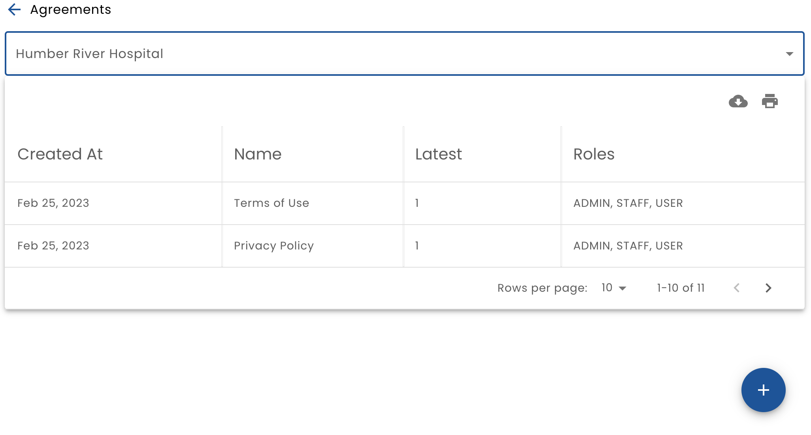
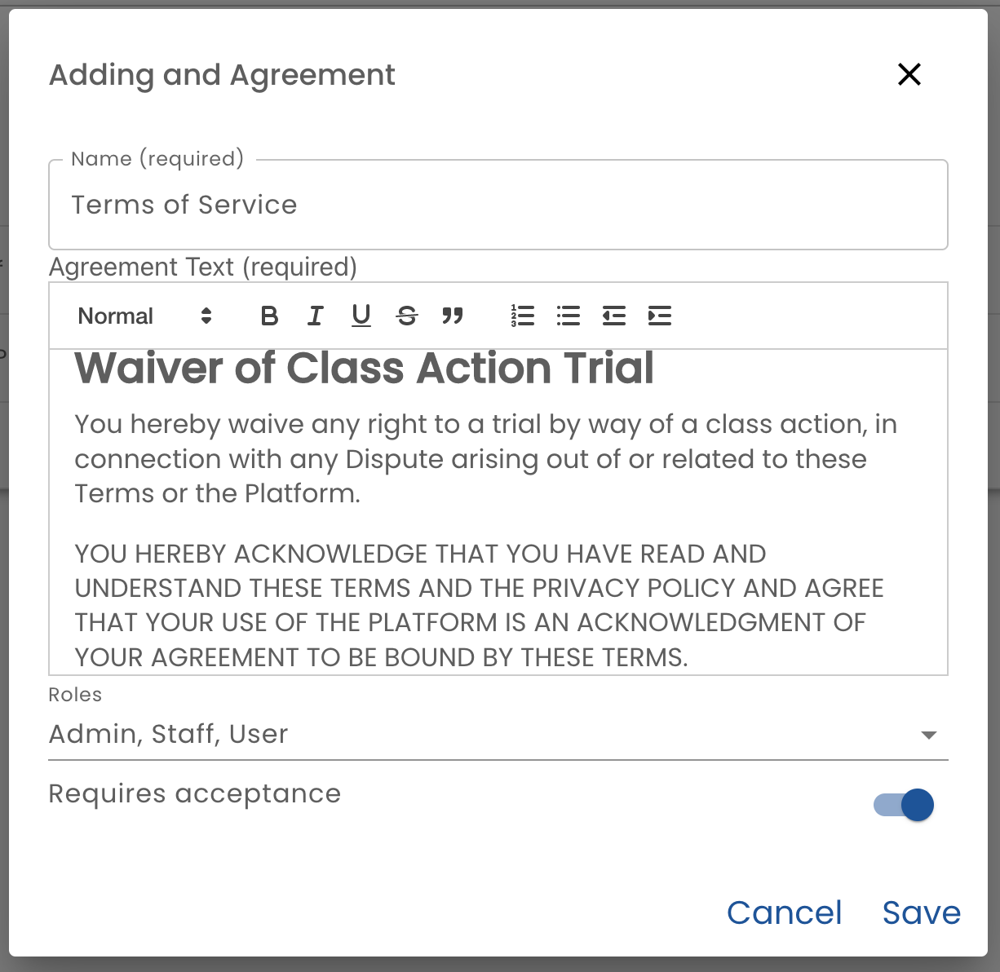
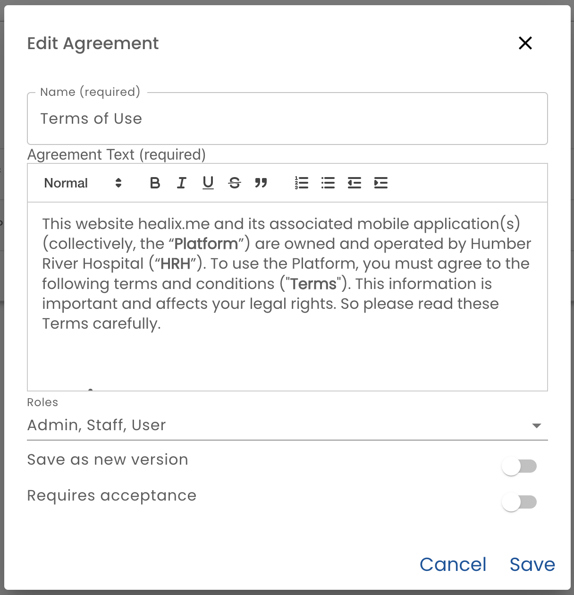
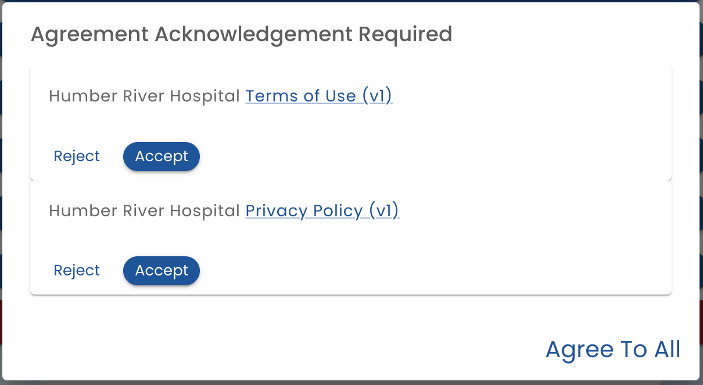

# Agreements

Agreements allow an organization admin to define the terms of use that a user must agree to in order to use the system.  When a user logs into the system, a prompt is presented (if required), the agreements can be reviewed, accepted or rejected.

When you select **Agreements** from the main menu.  a list of agreements is displayed.

## Creating a New Agreement

When adding a new agreement, complete the following form.

* **Name** - The name of the agreement that will be displayed when the agreement is being reviewed
* **Agreement Text** - A rich text editor where the agreement itself can be pasted and edited
* **Roles** - Select the Role that the agreement will apply to.
* **Requires Acceptance** - If this is on, then users will need to agree to the terms of the agreement before continuing. Turning it off is useful if you do not want to have users immediately be prompted with the new agreement.

## Editing an Agreement

Once the agreement has been added, it may be edited by clicking the row.

The fields here are the same as adding an agreement, but there is one additional option:

* **Save as new version** - when this on, the previous version is not overwritten when the agreement is saved. Instead a new version will be created and the version number will be incremented. 

### Requiring Re-agreement

When saving a new version of an agreement, you may or may not want to have users agree to it again.  If you select **Requires acceptance** when creating a new version of the agreement, then you are forcing all the users to review and agree to the new terms in order to continue using the software.

If you do not select **Requires acceptance**, then if a user has agreed to a previous version of the agreement it is considered good enough and the agreement will not be presented.

## Agreeing

When a user is required to do so, the agreements are displayed and the user is requested to agree.

Each required agreement is displayed.  All agreements may be accepted with the Agree to All button or agreements can be individually agreed to.

If an agreement is rejected, the user is removed from the organization and logged out.  The user may still use the system if they have agreed to the terms of a different organization.

