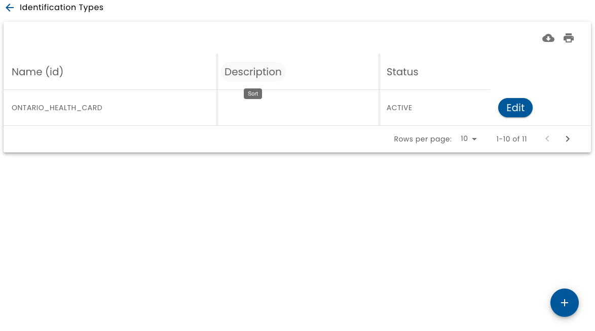

# Id Types

Identification types (Id Types) refer to physical identification artifacts such as driver's licenses, passports, health insurance cards, etc.

Id types are used during the [Manual Verification](../verifications) process.

When you select **Id Types** from the main menu.  a list of verification types available is displayed.

:::note

You must be an admin in a Jurisdiction in order to add or modify Id Types.

:::

## Defining an Id Type

When defining an id type, the following attributes must be configured:

* **Name** - A unique identifier for the Id (not shown directly to the user)
* **Description** - An optional description for the id type
* **Label** - The prompt shown to the user when requesting the id number
* **Placeholder** - The text shown in the field to enter the id number
* **Format** - When implemented, the format controls what types of characters are allowed in the id.  See https://imask.js.org/ for more details
* **Use Expiry Date** - If turned on, users will need to enter an expiry date

