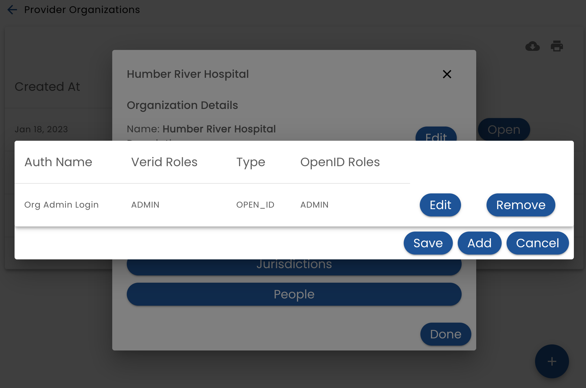
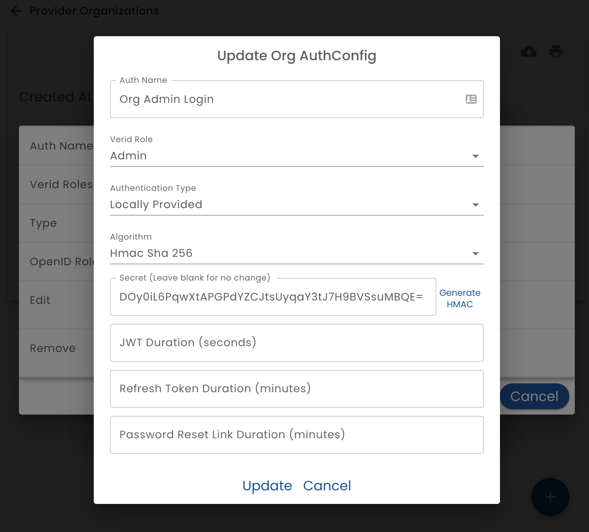
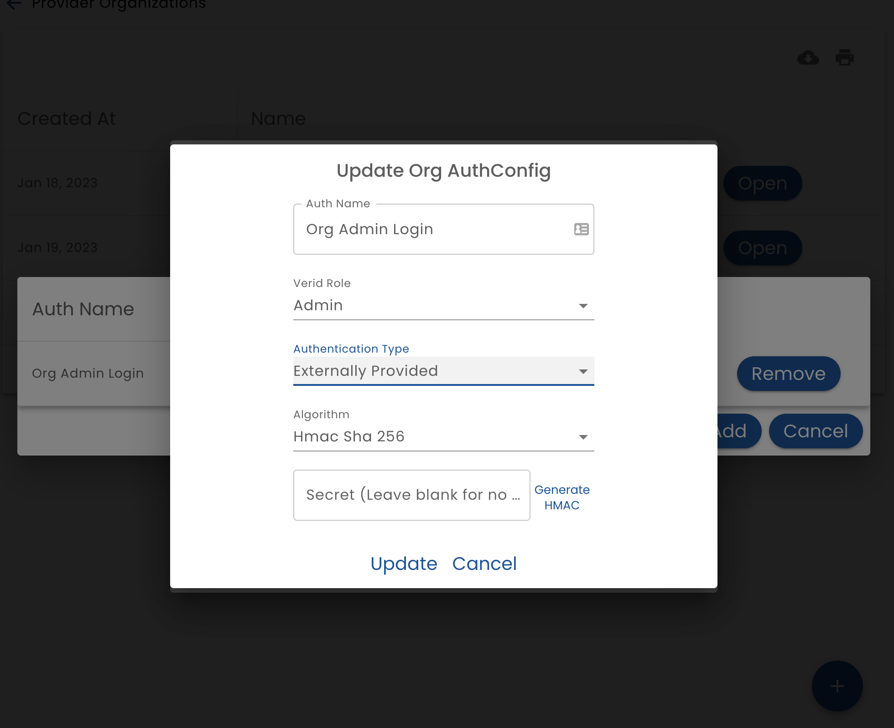
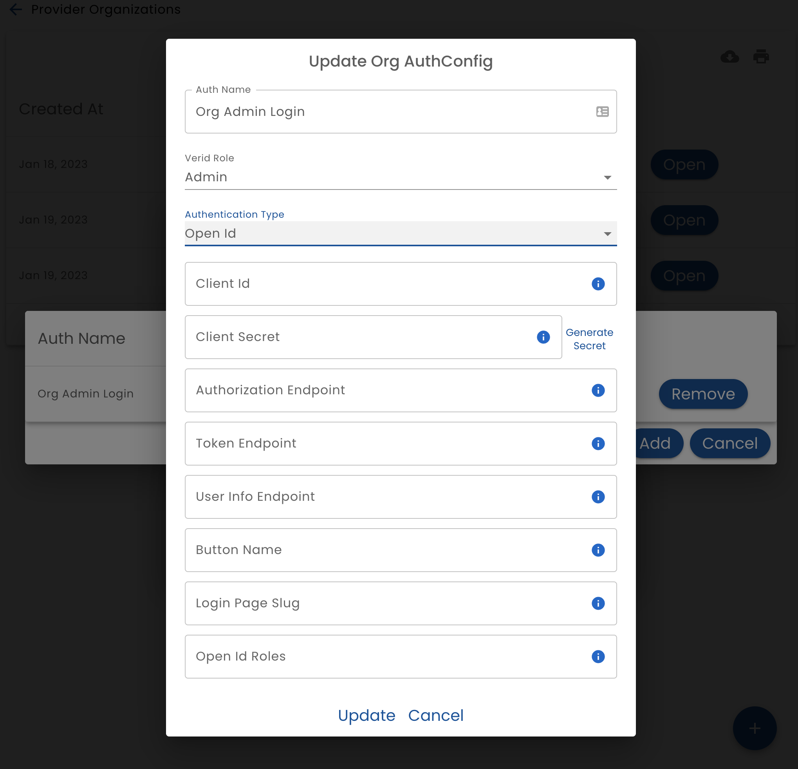

# Authentication Configuration

The Authentication Configuration option displays a list of authentication methods and allows you to add and modify them.

The authentication types that are supported are:

* **Locally Provided** - Verid manages the authentication and the user logs in with a email or phone number and a password (permanent or one-time-use) specific to Verid
* **Externally Provided** - The application that is using Verid has its own authentication mechanism (bring your own auth). Verid and the app set up a trust relationship through a shared secret.  This is used when you don't want Verid to provide any authentication services (for some or all of your users)
* **Open Id** - Users can authenticate using "Login With".  This can be "Login with Facebook" or "Login with Google", but more typically logging in with the system that manages authentication for your organization.  This allows users to sign in to the system with their work credentials (staff users) or your patient portal (end users)

An organization may define many configuration methods and allows them to be associated with user types. For example, you may want end users to login with a patient portal, while staff login with their work credentials.

## Locally Provided

When configuring local authentication (which is when Verid manages user authentication), provide the following settings:

* **Auth Name** - the name that this authentication configuration will be referred to
* **Role** - the [Role](/verid/using-verid/people/roles) that this authentication method will authenticate
* **Algorithm** - The algorithm a bit density of secrets generated to manage JWT tokens. Currently only HMAC is supported. RSA will be added in the future.
* **Secret** - The secret used to generate and verify tokens.  To generate a new secret click the **Generate HMAC** button.  This secret will be saved when you click the **Update** button.  Note that for security reasons, the secret cannot be retrieved once it is saved.  When you generate a new secret you must record it if you need to access it later. (Normally you do not need this secret.)
* **JWT Duration** - The number of seconds that the JWT is valid for.  (Typically around 10 minutes.) When the JWT expires, a new one is seamlessly and automatically generated using the a refresh token. 
* **Refresh Token** - The number of minutes that a refresh token is valid.  When a refresh token expires, the user is challenged to re-authenticate. For example set it to 30 days if you want users to be required to provide their password every 30 days.
* **Password Reset Link Duration** - The number of minutes a password reset link should be valid for

## Externally Provided

When configuring external authentication (when the system being integrated is doing the authentication), provide the following settings

* **Auth Name** - the name that this authentication configuration will be referred to
* **Role** - the [Role](/verid/using-verid/people/roles) that this authentication method will authenticate
* **Algorithm** - The algorithm a bit density of secrets generated to manage JWT tokens. Currently only HMAC is supported. RSA will be added in the future.  This must match the algorithm used by the external system* 
* **Secret** - The secret used to generate and verify tokens. This must match the secret being used by the external system

## Open Id

When configuring open id, provide the following settings:

* **Auth Name** - the name that this authentication configuration will be referred to
* **Role** - the [Role](/verid/using-verid/people/roles) that this authentication method will authenticate
* **Client Id** - The Oauth2 __client_id__ that has been determined by the identity provider
* **Client Secret** - The Oauth2 __client_secret__ that has been determined by the identity provider
* **Authorization End Point** - The Full URL of the Oauth2 Authorize endpoint
* **Token End Point** - The Full URL of the Oauth2 Token endpoint
* **User Info End Point** - The Full URL of the Oauth2 Userinfo endpoint
* **Button Name** - The text to display on the login button
* **Open Id Roles** - A comma separated list of roles that are accepted.  If the user logging in does not have one of the listed roles, they will not be able to login
