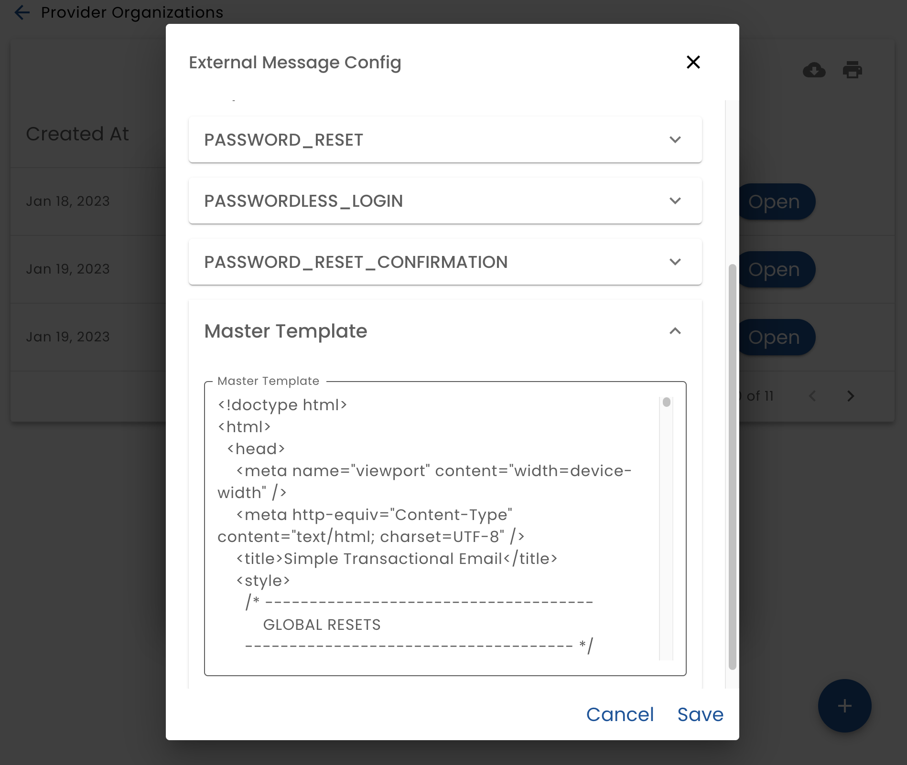
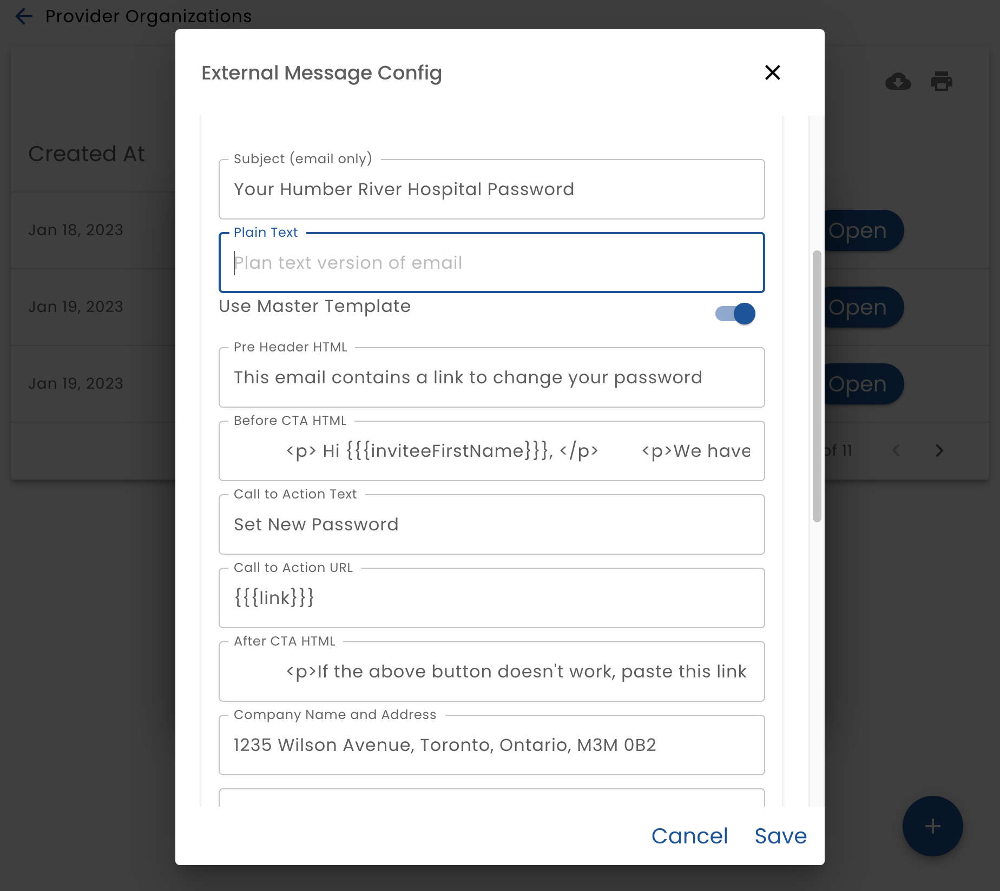

# External Messages - Templates

External message templates configures the appearance of sent messages. 

## Master Template

There is a _Master Template_ that provides common elements of each template, such as headers and footers.  The _Master Template_ is an ideal place to configure branding for the organization.




:::note

Each message template has a switch that allows you to leverage the master template or enter its own HTML 

:::

## Template Syntax

The template is HTML using a templating syntax for injecting data.

### HTML

It is important to note that the user's email client is used to render the HTML.  Due to security and privacy concerns, email clients implement a highly restricted rendering of the HTML it receives. This problem is compounded by the fact that there are many email clients and they all do not behave the same way.

:::caution

If you modify the provided template defaults, ensure that the messages will be displayed correctly by understanding what works and what does not work in email clients and carefully test. 

:::

:::tip

 MailTrap has some testing features that analyze the HTML and points out potential problems.  It is helpful, but not as good as testing in the actual email client.

:::

### Template Syntax

The messages sent by the system must be customized for the current situation.  For example, if the email message contains a magic link with a one-time password, this one-time password must be injected into the message.

Generally, this is done by using {{{variable-name}}}.  For example:

```
<span class="apple-link">{{{companyNameAndAddress}}}</span>
```

Using 3 {{{ instead of two {{ avoids HTML escaping.

More complex templating features from the Handle Bars templating language are available.  See https://handlebarsjs.com/ for details.

#### System Variables

There are some variables that are available for all template:

* **orgName**
* **recipientTitle**
* **recipientFirstName**
* **recipientMiddleName**
* **recipientLastName**
* **recipientEmail**
* **recipientPhone**
* **recipientFullName**
* **senderTitle**
* **senderFirstName**
* **senderMiddleName**
* **senderLastName**
* **senderEmail**
* **senderFullName**

#### Template Specific Variables

See the documentation for each template on which variables are available.


## Password Reset Email Template

You may configure how your email and SMS messages look when a user requests a password reset.  This applied to locally provided authentication methods only.



:::tip

You can use HTML and templating in all fields except the subject and plan text fields

:::
### Template Specific Variables

* **link** - the link which the user must click to reset the password
* **inviteeFirstName** - first name of the user


## Password Reset Confirmation

You may configure how your email and SMS messages look when a user finishes a password reset.  This applied to locally provided authentication methods only.

:::tip

You can use HTML and templating in all fields except the subject and plan text fields

:::
### Template Specific Variables

none


