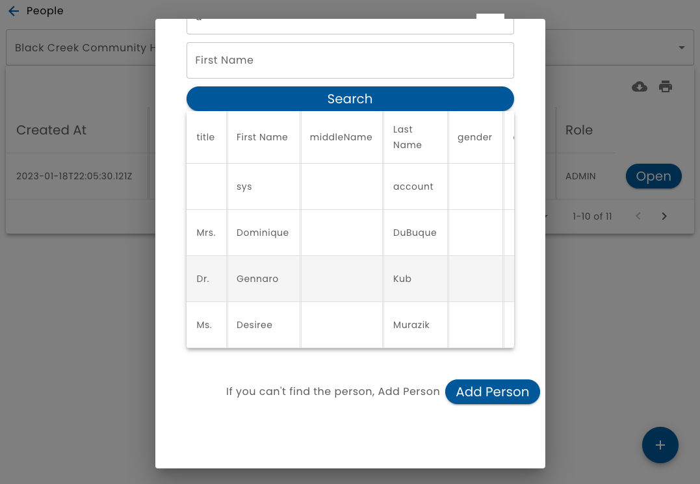
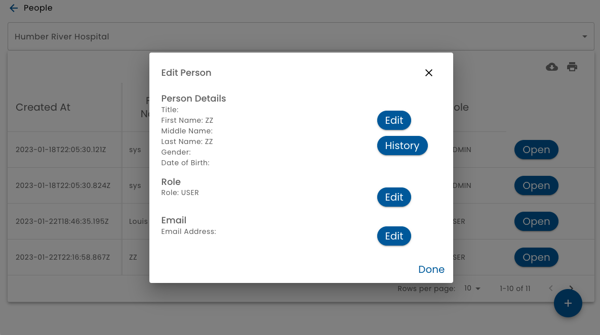

# People

The **People** option on the main menu, displays a list of people who have a relationship with the selected organization.

## Many to Many People to Organization Relationships

It is important to understand that a person may have a relationship with many organizations.  And, of course, a organization has relationships to many people.

When viewing a list of people, it is a list of people who have a relationship with the organization selected at the top of the screen.  (A choice of organizations is displayed only when you are a member of more than one organization.)

Verid tracks three distinct entities to manage this:

1.  **Organizations** 
* **People** - there should only be one of these per real person
* **PersonOrg** - Think of this like an _Account_.  There is a PersonOrg record when a person has a relationship with an organization.  This is where the person's role is defined.  So, any person might be a User role in one organization, a Staff role at a different organization and an Admin in a third organization, etc.

## Adding a Person

To add a person, click the **+** button.

The first step to adding a person is to search to see if the person already exists.  You can search by first or last name.

If the person is found, then click the **Use** button beside the person's name.

If the person is not found, then click **Add Person**.

* **Verification** - Any time you add or update a persons identity, it requires that you specify how the identity has been verified.  For more information, see [Verifications](/veird/using-verid/verifications/).
* **Role** - Specify the user's [Role](/veird/using-verid/people/roles)
* **Email and Password** - Assign a user and password if you like.  You may leave this blank.
* **System Account** - Check this box if the account is for the purpose of generating an API Key and is not associated with a real person

## Modifying a Person

To modify a person, click on the **Open** button on the person list.

To modify a person's identity, click the **Edit** button.

As with adding a person,  you must specify how the identity has been verified.  For more information, see [Verifications](/veird/using-verid/verifications/).

The complete history of all identity changes is tracked.  To view the identity change history and the related verifications, click the *History** button.

You can also modify the person's role and email address.

