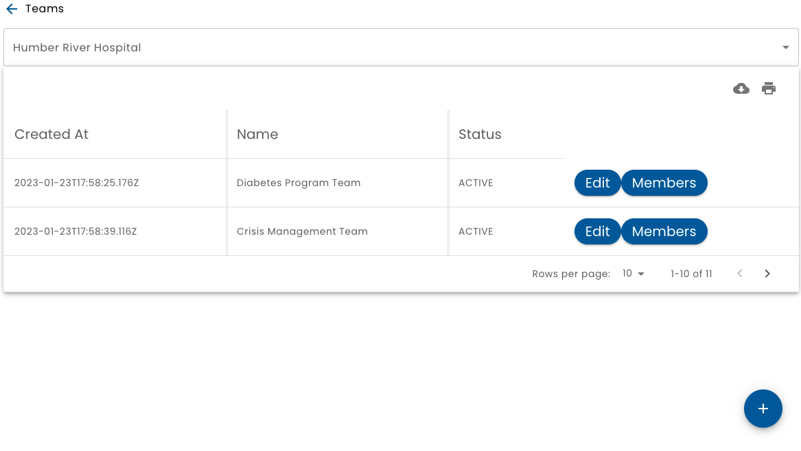

# Teams

Teams are groups of people.  Any member of team can be a "Staff" or "Admin" role within the team. Admin team members can modify team membership.

Apps that use Verid can leverage the team constructs as required.  For example, Healix allows a team to be assigned to roll allowing the actual individuals who pick up related tasks to be flexible.

The **Teams** choice on the main menu display a list of teams for the selected organization.

When adding team members, you can add an individual as an admin or staff.
