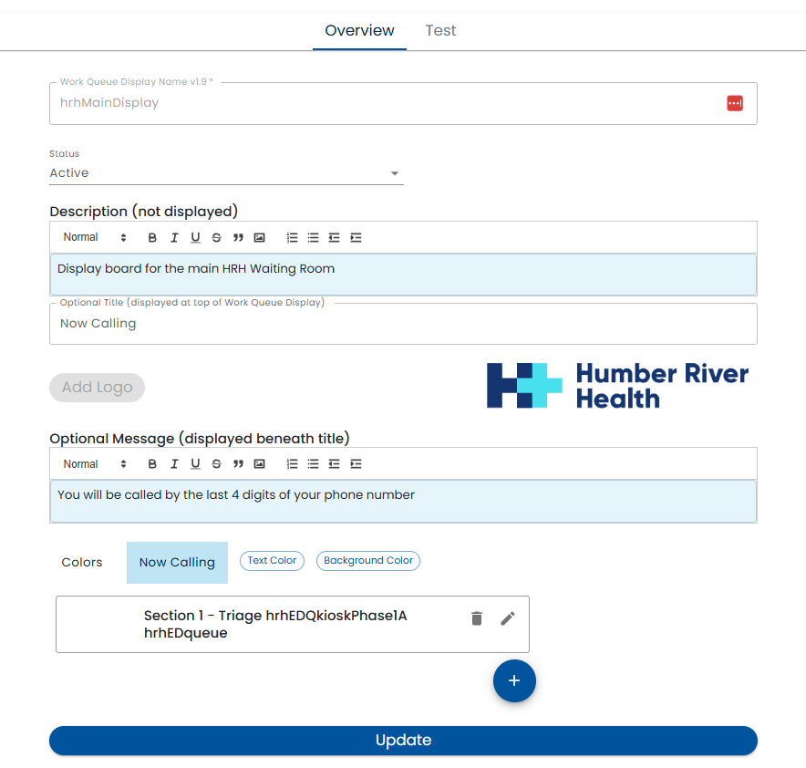
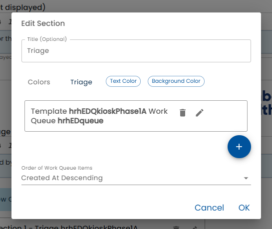
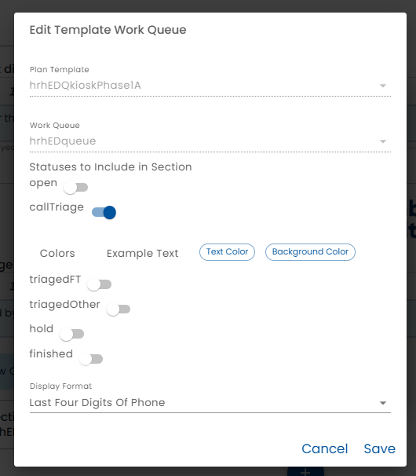

# Edit Work Queue Display

The Overview tab of the work queue display editor allows the configuration of the essential aspects of a work queue display.




* *Work Queue Display Name* - this is the name that other parts of the system, uses to refer to the work queue display.  For example, it is part of the URL used to access the work queue display.
* *Status* - the Status can be In Review or Active
  * *Active* - If the status is Active, users accessing the device will see that version
  * *In Review* - In the status is In Review, the changes are only shown in the test tab.  
* *Description* - the optional description text can contain internal notes about the work queue display.  For example, which room it is in, the type of device and it is used for
* *Title* - The Title is shown to users at the top of the large monitor.
* *Logo* - a logo can be optionally configured.  It is displayed beneath the title
* *Optional Message* - an optional message can be displayed beneath the title.  This can be used to provide additional information to people in the waiting room.
* *Colors* - the colors of the display can be configured.  
* *Sections* - Various sections that can be displayed on the work queue display. For example, people may be waiting for different types of services or at different stages of the workflow.

## Sections

When the *Edit* (pencil) button beside a Section is clicked or the Plus button is pressed to create a new section, the section editor is displayed. 



* *Title* - the title is displayed at the top the section and is optional.
* *Color* - the color of the section. 

### Template Work Queues

Each section can be configured to display work queue items from one or more [Work Queues](../../work-queues/creating-work-queues/index.md).  



* *Plan Template* - select the [Plan Template](../../creating-plans/creating-a-plan) that contains the work queue to be displayed.  Typically a plan referenced here has been built to be launched from the public device or has checking in at the public device as a step.
* *Work Queue* - select the work queue with in the template that will be displayed in the section.
* *Statuses* - After selecting the work queue, the statuses of the work queue items that will be displayed can be selected. Select the statuses that you want to be displayed in the section the color.  For example, if one of the statuses is *Waiting for Check In*, you may want to select the *Waiting for Check In*. Or perhaps the section is intended for *Now Serving* items, so you would select that status.
* *Color* - Select the color of the items that will be displayed in the section.
* *Display Format* - The display format can be set to:
  * *Custom Text* - You must define an expression using [Healix Expression Grammar](../../dynamic-data-model/healix-calculation-grammar) that will be displayed for each work queue item.
  * *First Initial Last Name* - The user's first initial of the first name and the last name will be displayed.  Note that there may be privacy concerns with displaying just the name.
  * *Full Name* - The user's full name will be displayed. Note that there may be privacy concerns with displaying just the name.
  * *Last Four Digits of Phone* - The last four digits of the user's phone number will be displayed. 
  * *Partial Email* - The user's email address will be displayed with only the first 3 characters of the local part of the email address and the "@" and the domain.
  * *Ticket Number* - The user's ticket number will be displayed.  This is typically used when the work queue items have a ticket number associated with them.
* *Expression* - The expression is used to display the work queue item information.  The expression can use [Healix Expression Grammar](../../dynamic-data-model/healix-calculation-grammar).  This is only visible if the *Display Format* is set to *Custom Text*.

## URL and Chrome Kiosk Mode

The URL of the public device is displayed.  This URL can be copied and pasted into the browser on the kiosk or tablet being used as a public device.

The Chrome browser has a kiosk mode that hides the address bar, launches in full screen and other features appropriate for running on a publicly shared hardware device.  For example, Chrome can be launched on a Windows machine in Kiosk mode as follows.  

```
"C:\Program Files\Google\Chrome\Application\chrome.exe" --user-data-dir="C:\Users\user\AppData\Local\Google\Chrome\User Data\Profile Kiosk" --kiosk http://healix.me/publicDeviceStart?org-id=hrh&device-name=lobbyKiosk
```

Chrome OS also has special kiosk features.


# Test

The *Test* tab is used to preview the Public Device Configuration. It varies from the "real" device in that QR Codes are clickable (for testing purposes) and navigation to other parts of Healix is possible.


