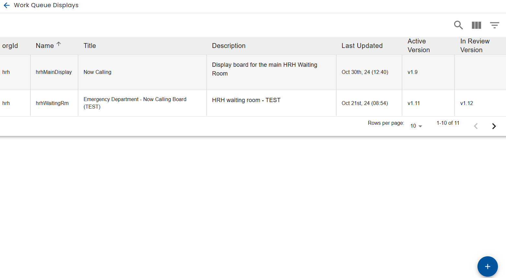

# Creating Work Queue Displays

Users with [content manager](../../using-healix/user-types.md) or administrator privileges are able to define work queue displays via the menu.

A list of work queue displays is displayed and you can create a new work queue display with the + button on the bottom right.

Creating or clicking on a work queue display, brings up the work queue display editor.
