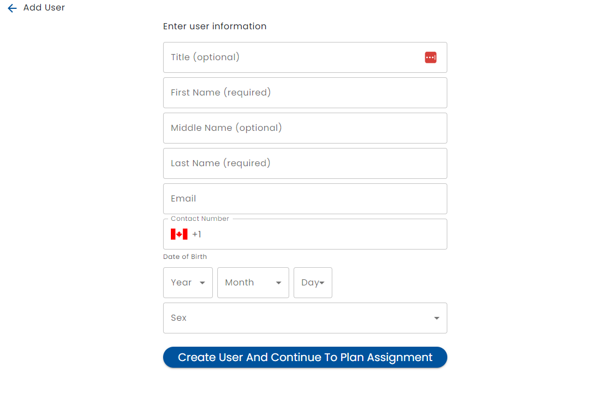
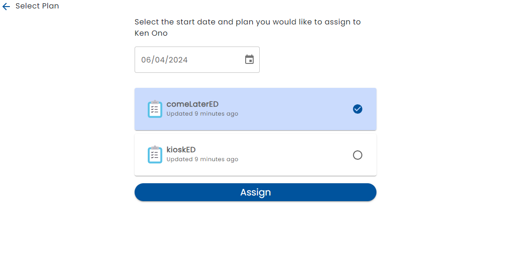

# Adding People to a Work Queue

Tasks (people) can be added to the work queue by using the + button on the bottom right of the screen.

It is important to understand that the Add process, only indirectly adds to the work queue.  The process that is invoked allows the addition of a user to the system and / or the assignment of a plan to user.  The act of assigning a plan to the user, and potentially the actions of that user will result in the addition of a work queue item.  If adding a plan to a new or existing user does not end up creating a work queue item, refer to the [Plan](../creating-plans/creating-a-plan) definition.

When the Add button is created, a screen to search for existing users is presented.  This is to prevent people from being added to the system more than once.

If (+) is selected, a screen is selected so you can add a new person to the system:

Once you create a user, or select a user from the search screen, a plan can be assigned.  The plans are limited to the plans that are related to the work queue.

See [Assigning a Plan](../admin/assign-care-plan) for more details.

