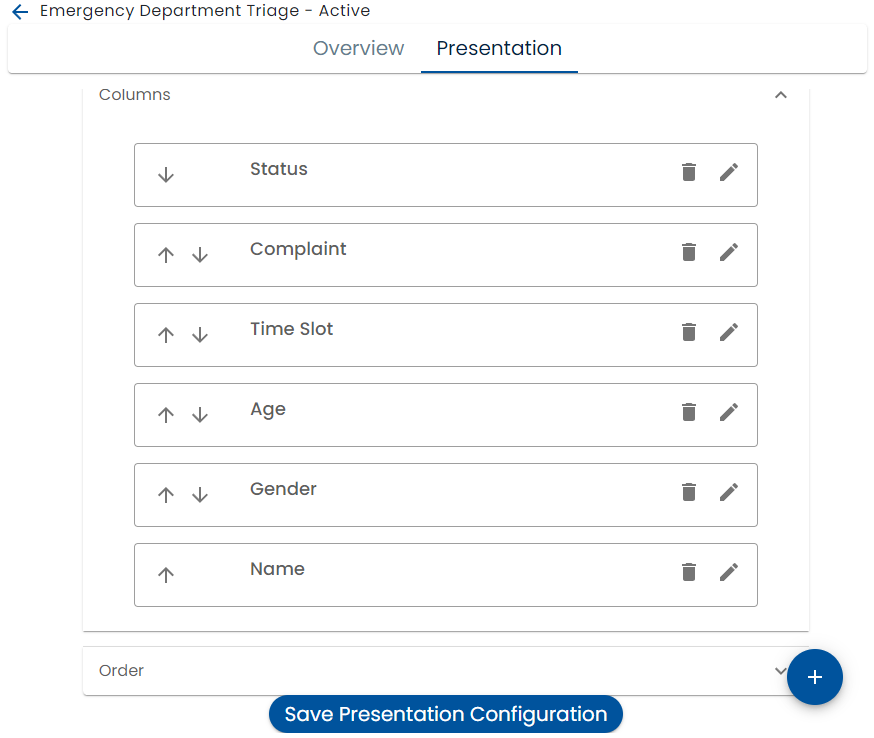
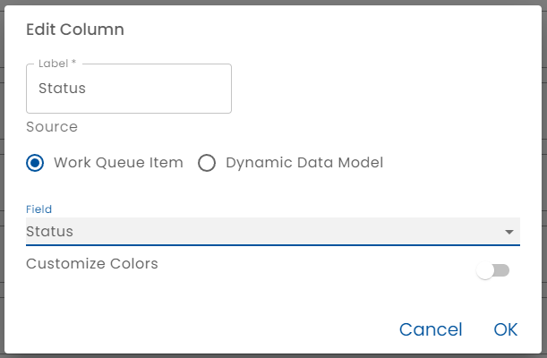
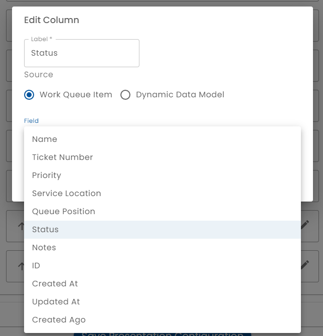
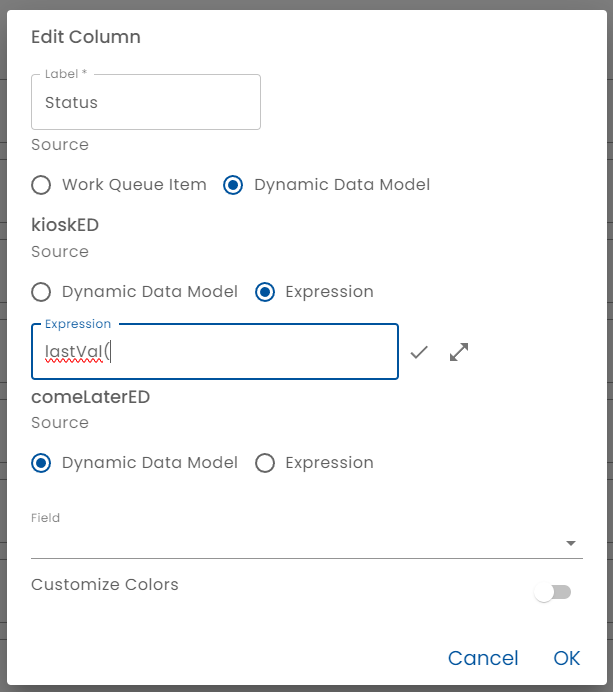
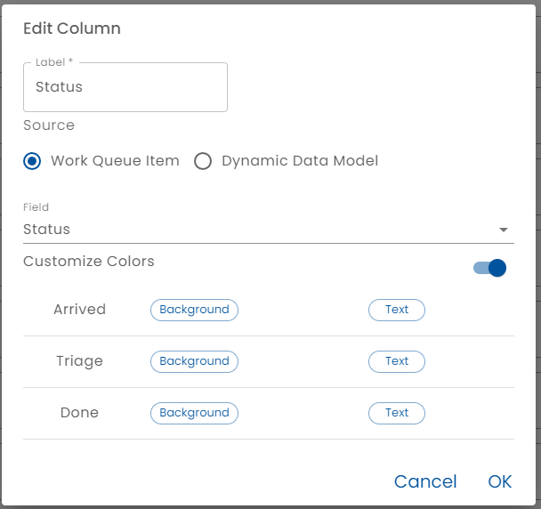
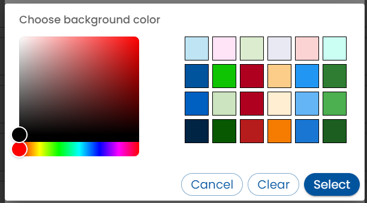
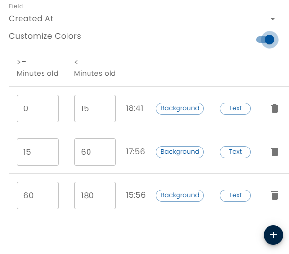
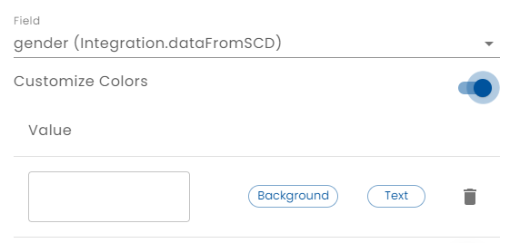

# Edit Work Queue Presentation

The Presentation Tab configures the columns that are displayed in the work queue list and the order of the work queue items.

The order of the columns can be changed by clicking the arrows to move a field up or down.  The top most field correlates to the left most column, etc.  Click the garbage can to delete a column, the pencil to edit column and the + to add a column.  

You changes are not saved until *Save Presentation Configuration* is clicked.

## Editing a Column

* *Label* - The label is the text displayed in the column heading
* *Source* - The source can be *Work Queue Item* or *Dynamic Data Model*

### Work Queue Item Column Display

Work Items columns are displayed directly from the Work Queue Item table and appear instantly. Configuring is a simple matter of selecting from a fixed list of fields.

### Dynamic Data Model Column Display

A column that derives data from the [dynamic data model](../../dynamic-data-model/) provides the ability to display data from submitted forms, incoming integration events, the related plan and the ability to enter an expression that combines data.

When configuring a dynamic data model column, a definition for each plan template that interacts with the work queue must be configured.  This is because the dynamic data model depends on the forms and integrations created in each template and a field reference in one plan template may not be valid in a different plan template.

A column can be configured with a simple drop down of fields that are defined in the dynamic data model.  This will use the last known value of the selected field.  For example, if form A was submitted twice, referencing a field on form A will take the value in the latest form submission.

A column can also be configured with an expression.  This allows a [formula](../../dynamic-data-model/healix-calculation-grammar) to be entered.

### Colors

The color of a cell in the work queue item list can be configured.

If there is a known list of values, such as in the status field, a background and foreground color can be configured for each known value.

Clicking the color buttons pops a a color selector.

The color pop allows the selection of any color and offers a pallette of Healix theme colors.  It is recommended that theme colors are used.

Date fields allows special aging colors to be entered.

Other field types allow a simple value to color map to be defined.

## Associating a Work Queue with a Plan

Work Queues are automatically associated with a plan template by defining a [rule](../../creating-plans/rules/) that creates or reads a work queue field.

