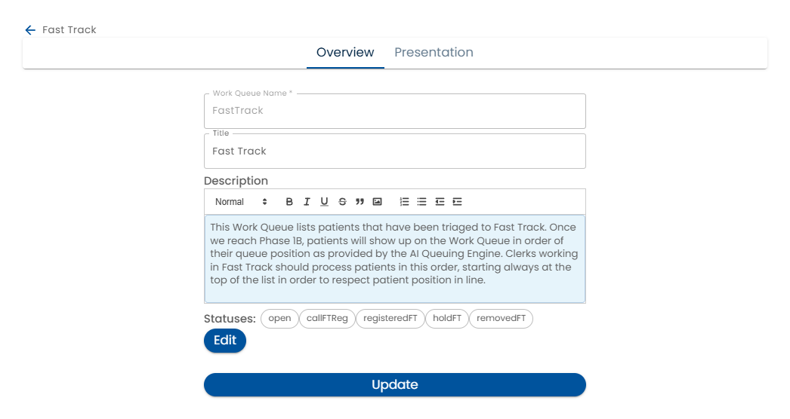
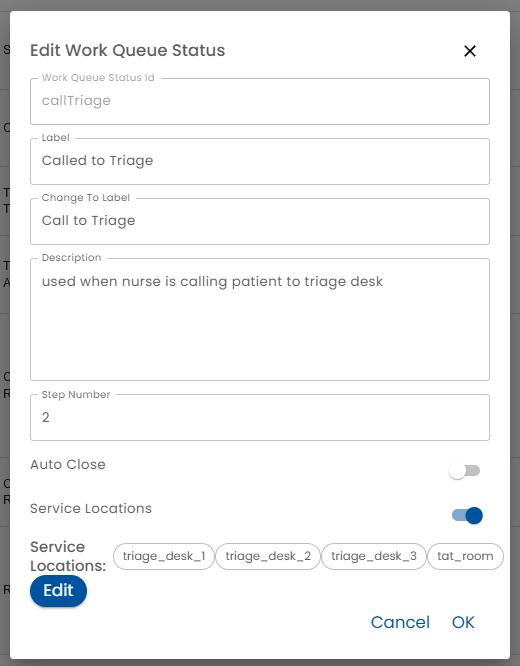

# Edit Work Queue

The Overview tab of the work queue editor allows the configuration of the essential aspects of a work queue.

* *Work Queue Name* - this is the name that other parts of the system, such as the [dynamic data model](../../dynamic-data-model/) uses to refer to the work queue.

* *Status* - the Status can be In Review or Active

  * Active - If the status is Active, users accessing the work queue from the home page will see that version
  * In Review - In the status is In Review, the [simulator](../../creating-plans/simulator/) will use that version.  
* *Title* - The Title is shown to users in order to access the work queue
* *Description* - Some text to describe the purpose of the work queue
* *Statuses* - Various statuses can be configured
* *Service Locations* - Service locations, e.g. Window 1 or Window 2, can be configured.

## Statuses

When the *Edit* button beside the Statuses list is clicked a list of Statuses is displayed.

Clicking on will edit and clicking on the + button will create a new Status.

* *Status Id* - the Status Id is how this status is referred to.  For example, you can use a [rule](../../creating-plans/rules/) to reference the work queue using the [dynamic data model](../../dynamic-data-model/).
* *Label* - the label is shown to users to display the current status
* *Change To Label* - this label is shown when giving users the choice to move a work queue item to this status.
* *Description* - A description of the status
* *Step Number* - Typically, a work queue item moves through a series of steps.  This number defines that order which in turn, determines the order that statuses are presented to users.
* *Auto Close* - Turning on Auto Close and entering a duration causes items to be automatically dropped from the work queue item list after the specified period of inactivity.  For example, if 1 is entered in the Days field for the "closed" status, then closed work queue items will appear for one day after the last activity allowing it to be reopened or appear in search.  

:::note

Locking a work queue item is considered an activity so simply clicking a work queue item will reset the clock.

:::