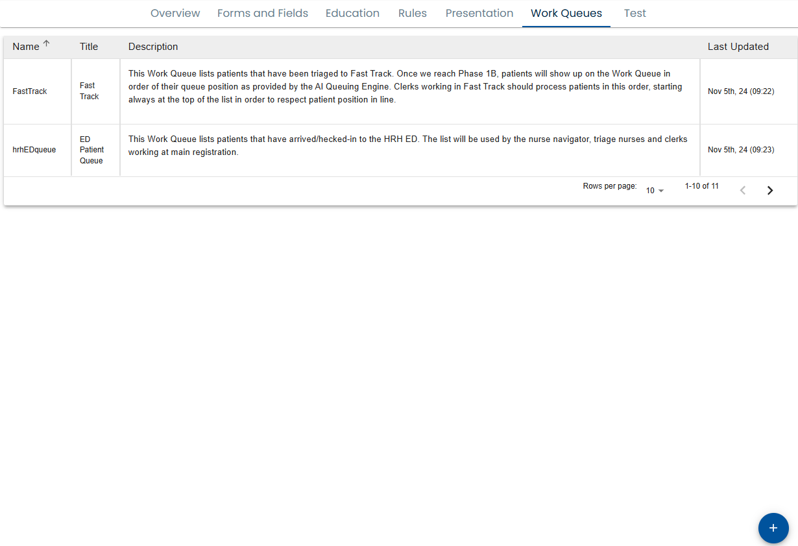

# Creating Work Queues

Users with [content manager](../../using-healix/user-types.md) privileges are able to define work queues via the menu.

A list of work queues is displayed and you can create a new work queue with the + button on the bottom right.

Creating or clicking on a work queue, brings up the work queue editor.
