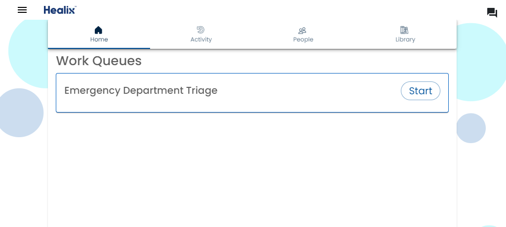
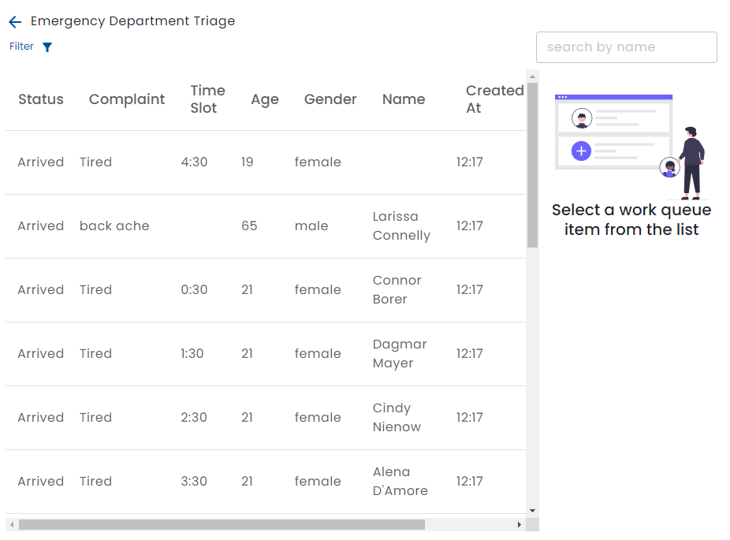
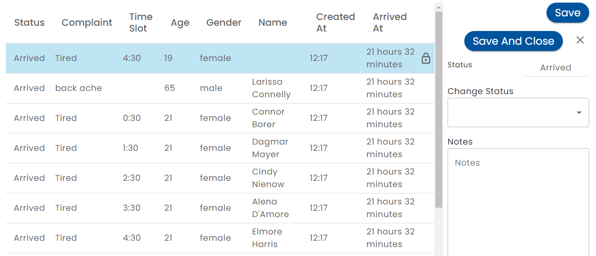
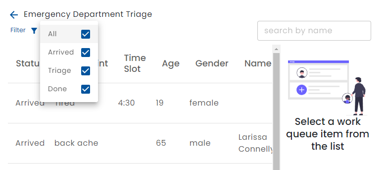

# Using Work Queues

If you have been [assigned to a work queue by an administrator](./admin-work-queue), you will have a task added to your home screen that leads to a work queue.

The columns and colors that are displayed are [configured](./creating-work-queues/) by a content manager.

## Editing a Work Queue Item

When you select a work queue item, the right hand panel allows you to change the status and add notes.

Use the drop down to change the work queue item status.  The *Save* button saves changes your changes but keeps the record open and locked.  The *Save and Close* button saves your changes, releases the lock and returns you to the list.  To close and release the work queue item without saving, click the ✕ button.

## Work Queue Item Locking

Note the Lock icon appears when you have selected a work queue item.  This icon also appears on other users screen to show that the item is being worked on by someone else and it prevents them from changing it.

After a brief timeout period, an *Unlock* button appears allowing you to make changes.

## Searching and Filtering

The work queue item list can be filtered by status.

Use the filter dropdown to select all or some of the statuses that are shown on the list.  Type a name in the search to find a person.

:::tip

The filter is ignored when you search by name.

:::
